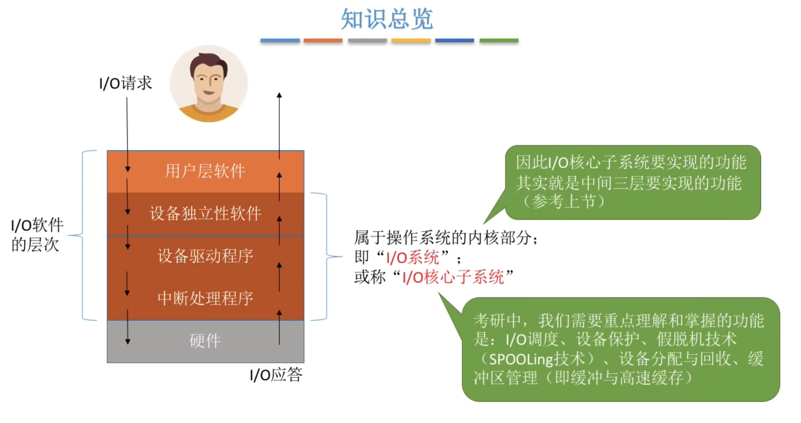
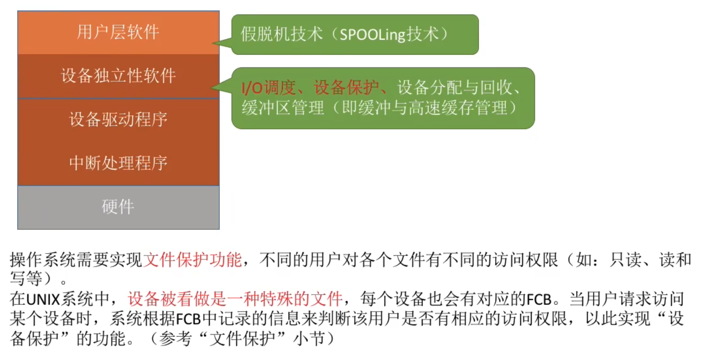

- [这些功能要在哪个层次实现](#这些功能要在哪个层次实现)
- [设备保护](#设备保护)

# 这些功能要在哪个层次实现
|层次|功能|
|---|---|
|用户层软件|假脱机技术(SPOOLing技术)|
|设备独立性软件|IO调度、设备保护、设备分配与回收、缓冲区管理（即缓冲与高速缓存）
|设备驱动程序|
|中断处理程序|
|硬件|

IO调度：用某种算法确定一个好的顺序来处理各个IO请求

如：磁盘调度（先来先服务算法、最短寻道优先算法、SCAN算法、C-SCAN算法等）。当多个磁盘IO请求到来时，用某种调度算法确定满足IO请求的顺序。

# 设备保护
