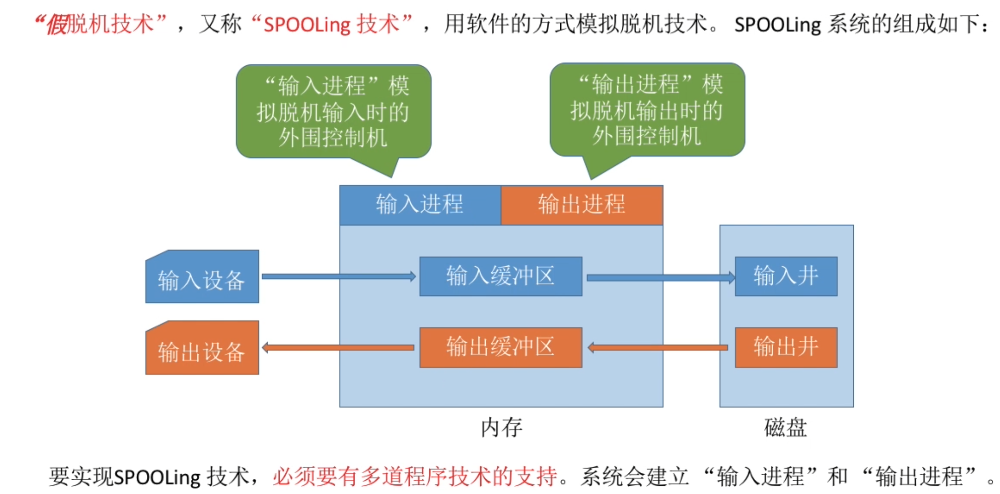
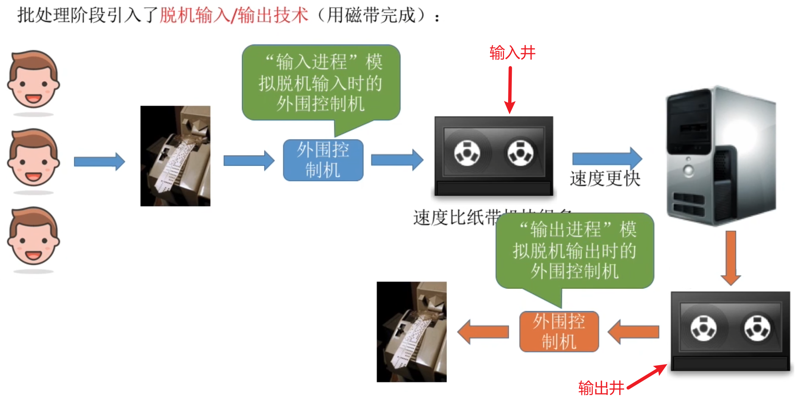
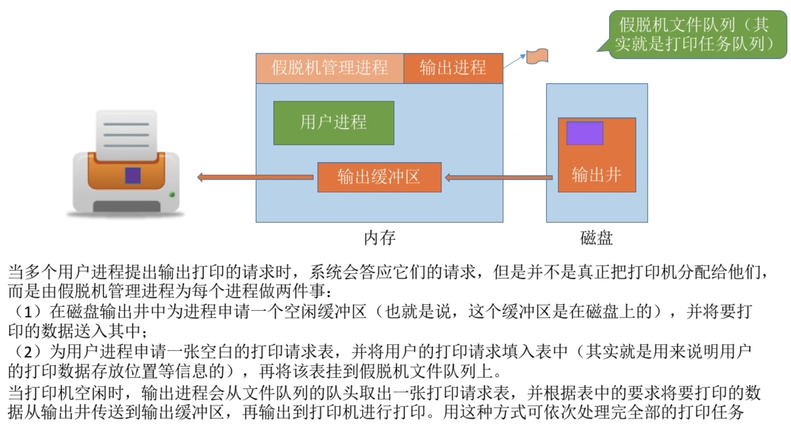
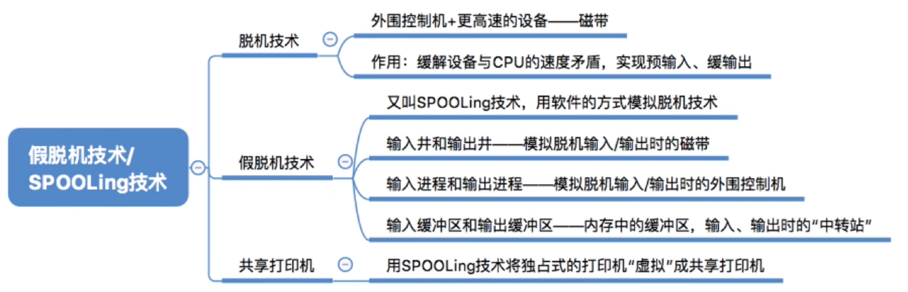

- [什么是假脱机技术](#什么是假脱机技术)
- [假脱机技术--输入井和输出井](#假脱机技术--输入井和输出井)
- [共享打印机原理分析](#共享打印机原理分析)
- [知识总览](#知识总览)

# 什么是假脱机技术
由于以前计算机处于**手工操作阶段**: 主机直接从IO设备获得数据,由于设备速度慢, 主机速度很快。人机速度矛盾明显，主机要浪费很多时间来等待设备

所以在后面的**批处理阶段**引入了脱机输入/输出技术(用磁带完成)

为什么称为"脱机"--脱离主机的控制进行的输入/输出操作.

# 假脱机技术--输入井和输出井
基于**脱机技术**的思想,人们就发明了"**假脱机技术**".\
又称"**SPOOLing技术**"是用`软件的方式模拟脱机技术`。SPOOLing系统的组成

- "输入井"模拟脱机输入时的磁带,用于收容IO设备输入的数据
- "输出井"模拟脱机输出时的磁带,用于收容用户进程输出的数据
- 输入进程: 暂存从**输入设备**输入的数据到"**输入缓冲区**", 之后再转存到**输入井**中
- 输出进程: 暂存从输出井送来的数据,之后再传送到输出设备上

# 共享打印机原理分析
**独占式设备**--只允许各个进程串行使用的设备。一段时间内只能满足一个进程的请求。\
**共享设备**--允许多个进程"同时"使用的设备(宏观上同时使用, 微观上可能是交替使用).可以同时满足多个进程的使用请求

虽然系统中只有一台打印机,但是每个进程提出打印请求时, 系统都会为在输出井中为其分配一个存储区(相当于分配了一个逻辑设备), 使每个用户都觉得自己在独占一台打印机, 从而实现打印机的共享。

SPOOLing技术可以把一台物理设备虚拟成逻辑上的多台设备，可将独占式设备改造成共享式设备

# 知识总览
