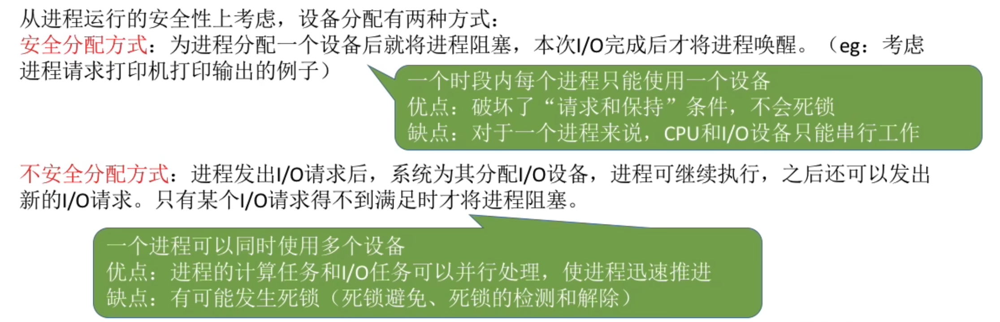

- [设备分配时应考虑的因素](#设备分配时应考虑的因素)
- [静态分配和动态分配](#静态分配和动态分配)
- [设备分配管理中的数据结构](#设备分配管理中的数据结构)
- [设备分配步骤](#设备分配步骤)
- [知识总览](#知识总览)

# 设备分配时应考虑的因素
1. 设备的固有属性
2. 设备分配算法
3. 设备分配中的安全性

设备的固有属性可分为三种: 独占设备、共享设备、虚拟设备。
- 独占设备--一个时段只能分配给一个进程(如打印机)
- 共享设备--一可同时分配给多个进程使用(如磁盘)，各进程往往是宏观上同时共享使用设备而微观上交替使用。
- 虚拟设备--采用SPOOLing 技术将独占设备改造成虚拟的共享设备，可同时分配给多个进程使用(如采用 SPOOLing 技术实现的共享打印机)

设备的分配算法
- 先来先服务
- 优先级高者优先
- 短任务优先
- ...

# 静态分配和动态分配
静态分配: 进程运行前为其分配全部所需资源, 运行结束后归还资源

动态分配: 进程运行过程中动态申请设备资源

# 设备分配管理中的数据结构

# 设备分配步骤

只有设备、控制器、通道三者都分配成功时，这次设备分配才算成功，之后便可启动IO设备进行数据传送

缺点：
1. 用户编程时必须使用"物理设备名", 底层细节对用户不透明, 不方便编程
2. 若换了一个物理设备, 则程序无法运行
3. 若进程请求的物理设备正在忙碌, 则即使系统中还有同类型的设备,进程也必须阻塞等待

改进: 建立逻辑设备名与物理设备名的映射机制, 用户编程时只需要提供逻辑设备名

# 知识总览
