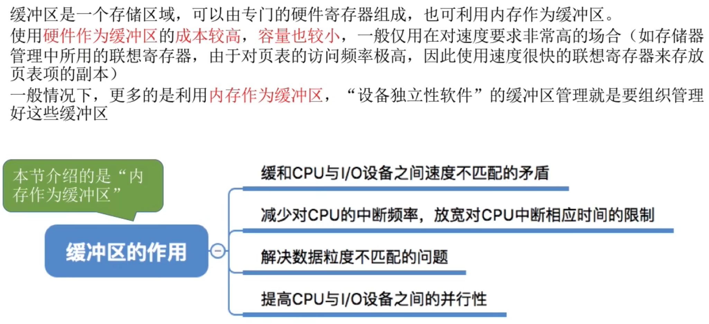
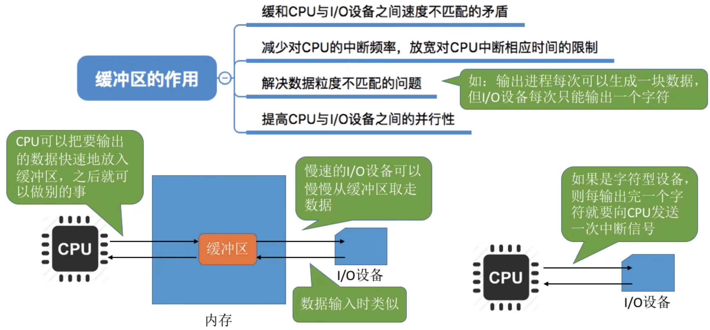
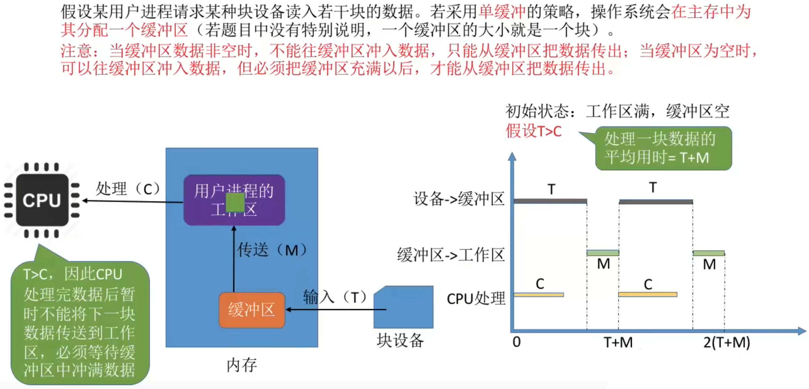
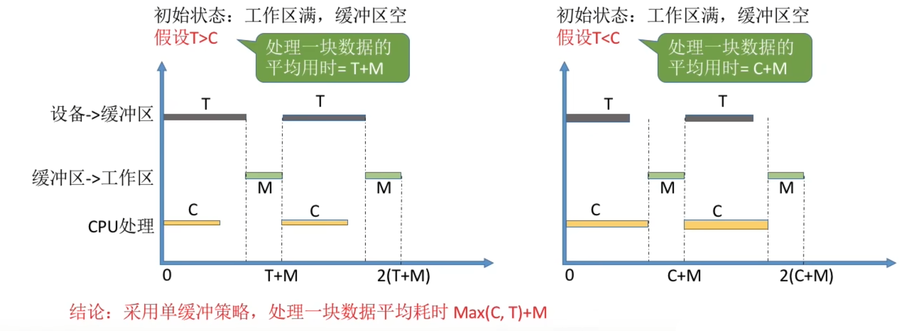
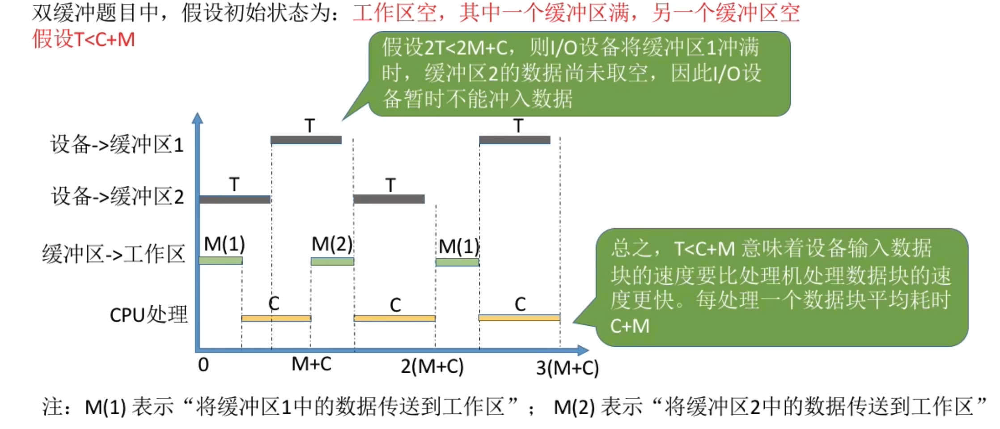
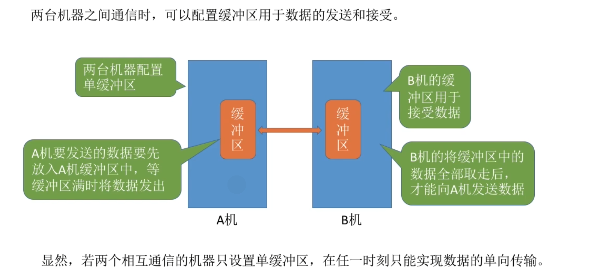
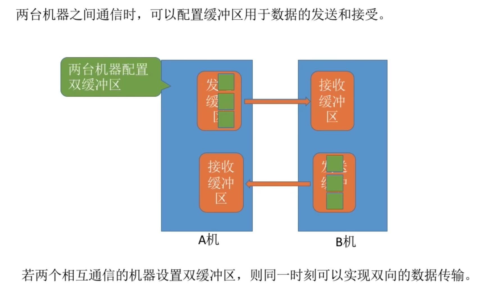
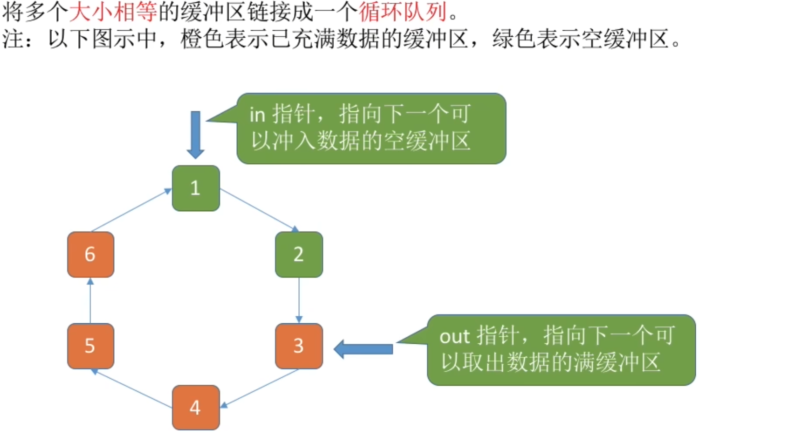
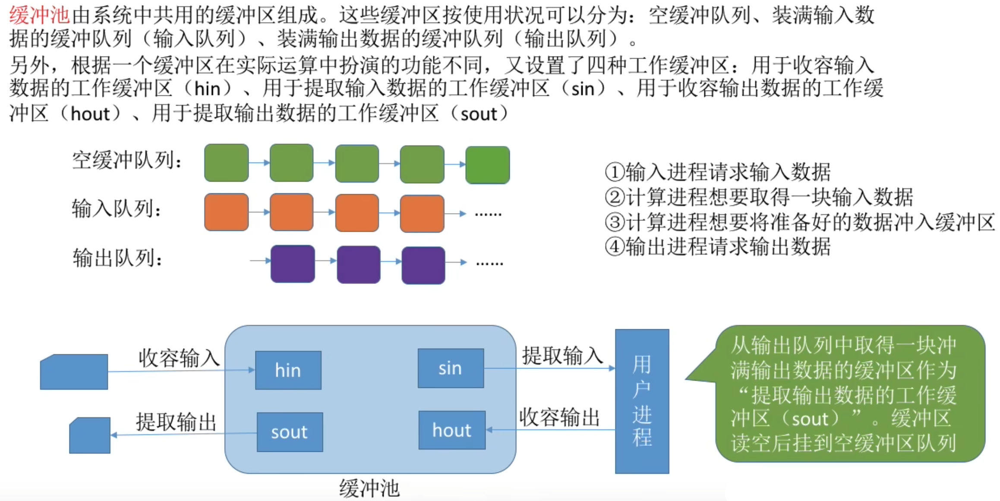
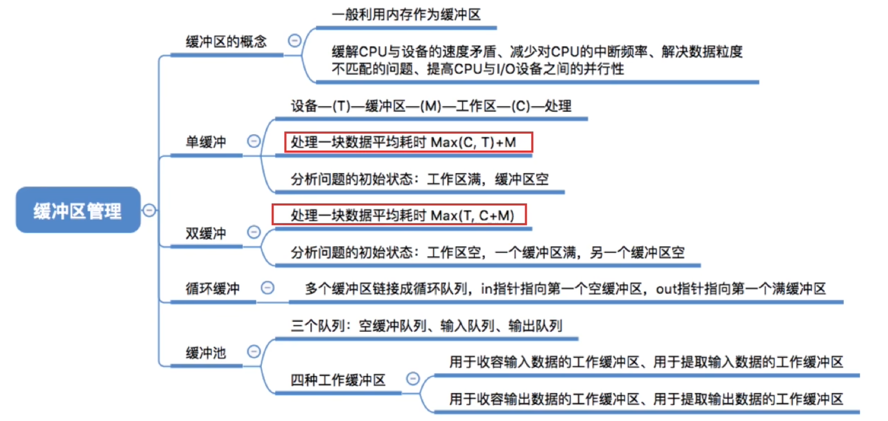

- [什么是缓冲区](#什么是缓冲区)
- [缓冲区有什么作用](#缓冲区有什么作用)
- [单缓冲](#单缓冲)
- [双缓冲](#双缓冲)
- [使用单/双缓冲在通信时的区别](#使用单双缓冲在通信时的区别)
  - [循环缓冲区](#循环缓冲区)
- [缓冲池](#缓冲池)
- [知识总览](#知识总览)

# 什么是缓冲区

# 缓冲区有什么作用

# 单缓冲

# 双缓冲
假设某用户进程请求某种设备读入若干块的数据。若采用双缓冲的策略，操作系统就会在主存中为其分配两个缓冲区（若题目中没有特殊说明，一个缓冲区的大小就是一个块）

结论: 采用双缓冲策略, 处理一个数据块的平均耗时为Max(T, C+M)

# 使用单/双缓冲在通信时的区别

## 循环缓冲区

# 缓冲池

# 知识总览
