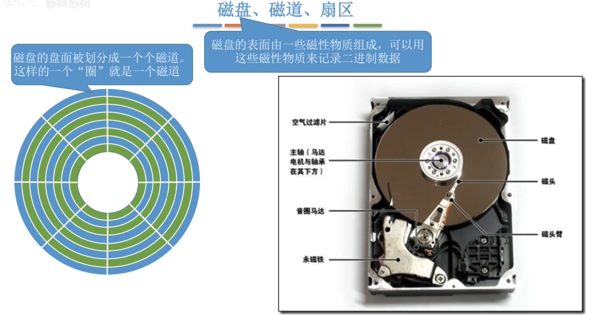
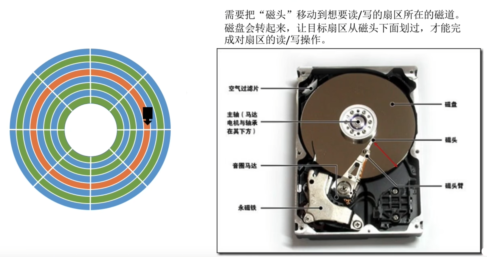
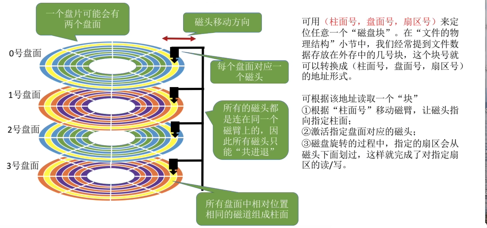
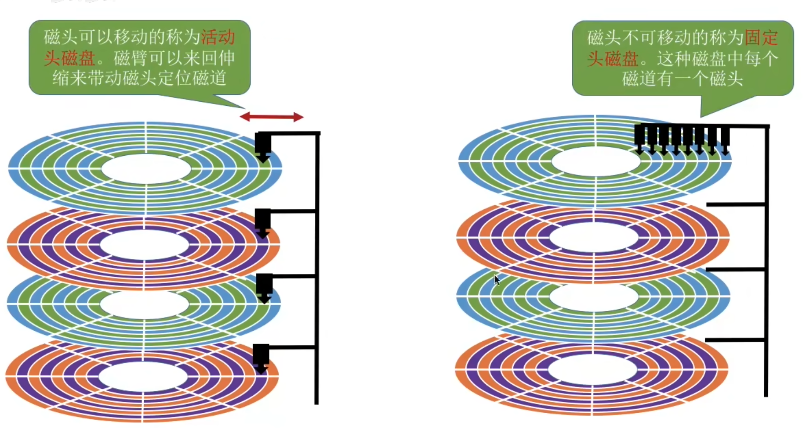
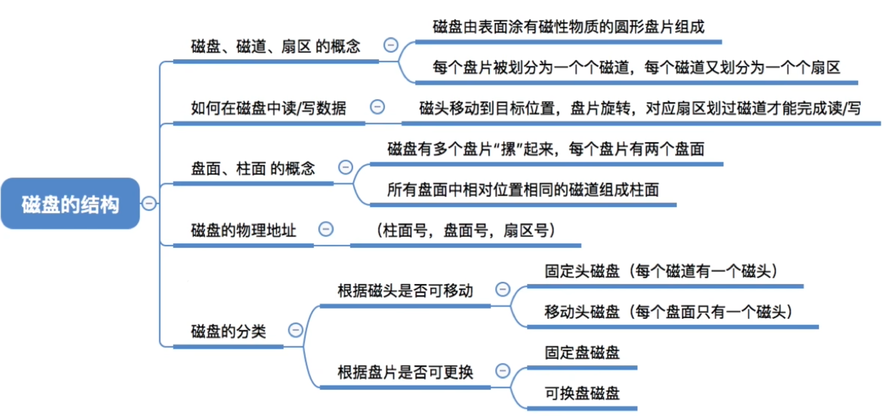

- [磁盘的结构](#磁盘的结构)
- [如何在磁盘中读写数据](#如何在磁盘中读写数据)
- [磁盘的物理地址](#磁盘的物理地址)
- [磁盘的分类](#磁盘的分类)
- [知识回顾](#知识回顾)

# 磁盘的结构

- 一个磁道又被划分为一个个扇区,每个扇区就是一个"磁盘块"。各个扇区存放的数据量相同
- 最内侧磁道扇区面积最小，因此数据密度最大

# 如何在磁盘中读写数据

# 磁盘的物理地址

# 磁盘的分类

磁盘可以更换的称为`可换盘磁盘`\
不可更换的称为`固定盘磁盘`
# 知识回顾
