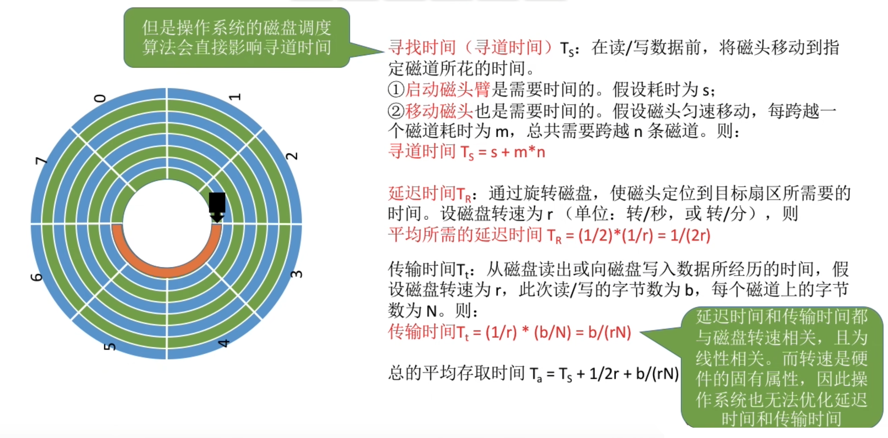
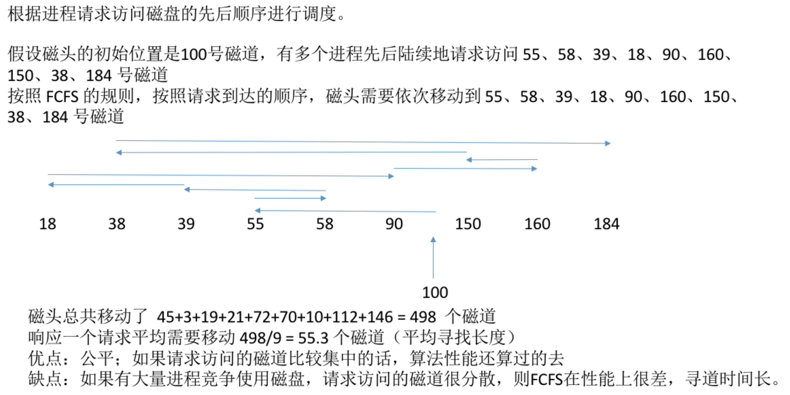
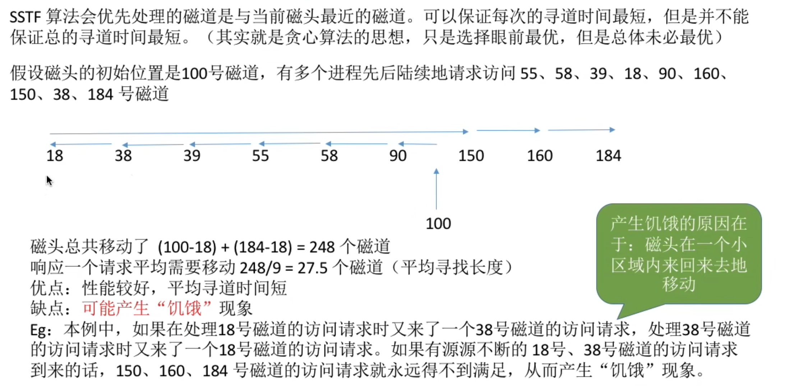
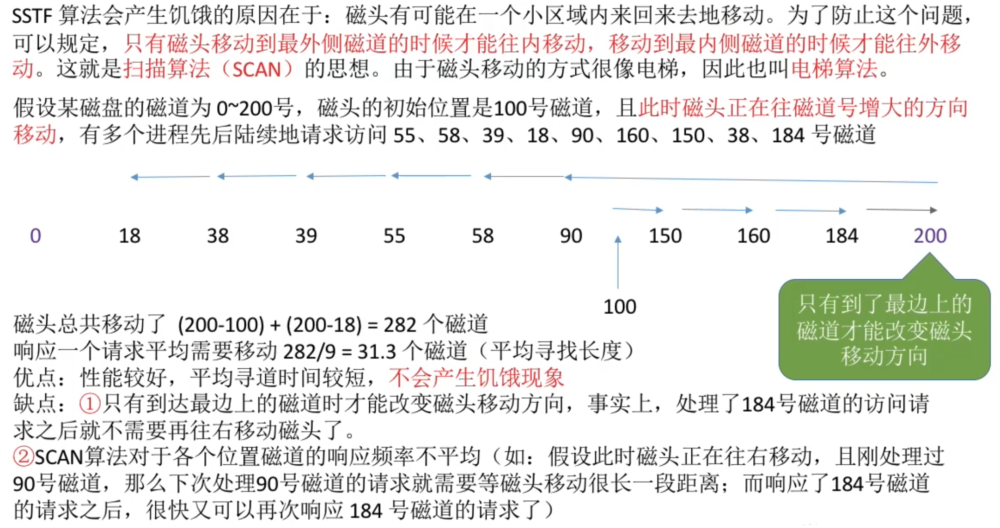
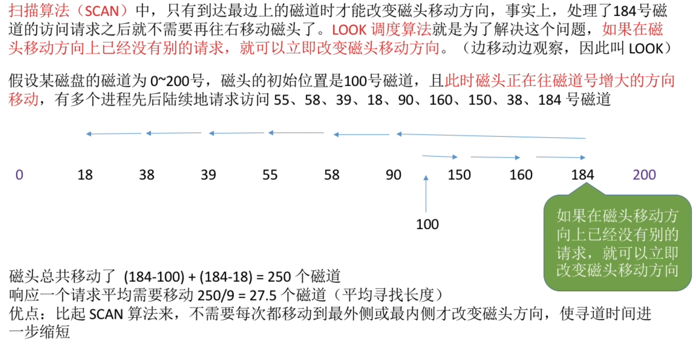
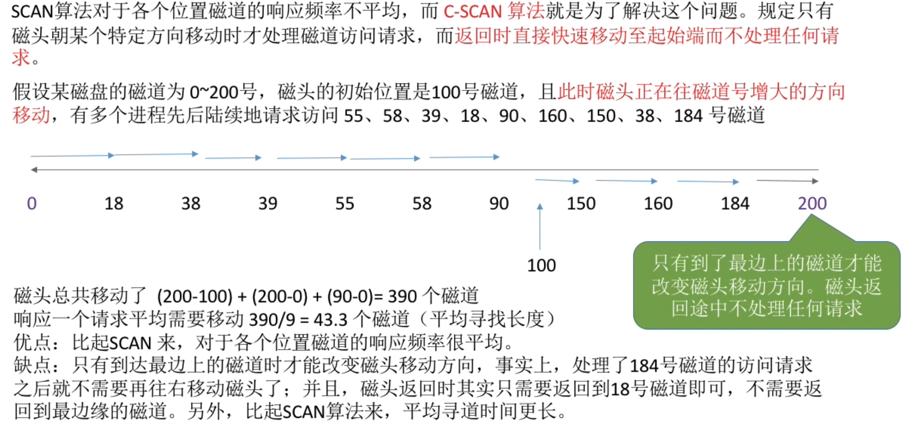
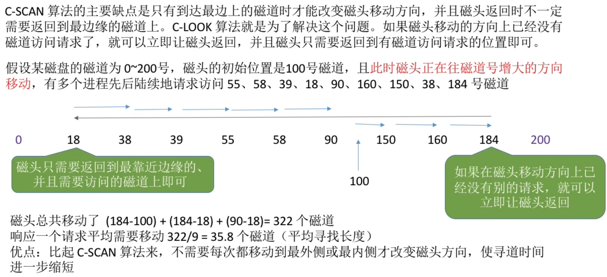
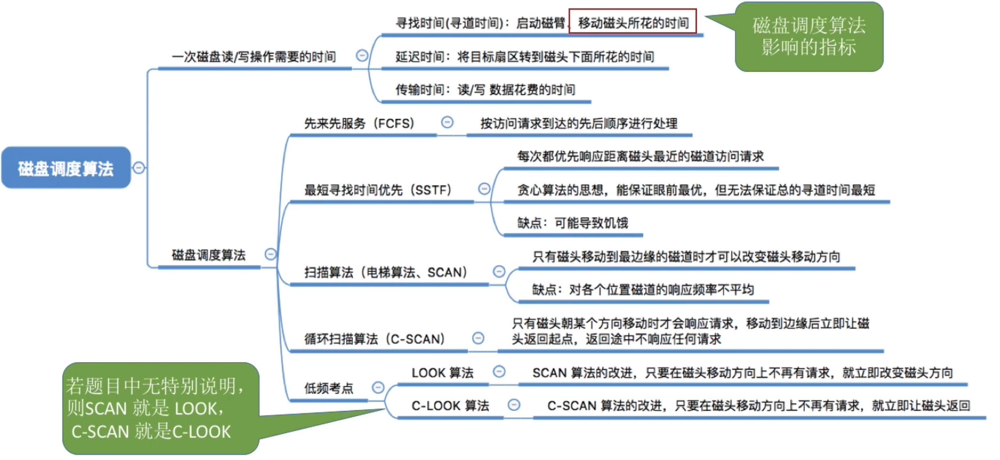

- [一次磁盘读/写操作需要的时间](#一次磁盘读写操作需要的时间)
- [先来先服务算法](#先来先服务算法)
- [最短寻找时间优先](#最短寻找时间优先)
- [扫描算法](#扫描算法)
- [LOOK调度算法](#look调度算法)
- [循环扫描算法(C-SCAN)](#循环扫描算法c-scan)
- [C-LOOK调度算法](#c-look调度算法)
- [知识回顾与重要考点](#知识回顾与重要考点)

# 一次磁盘读/写操作需要的时间

转动磁盘所需要的时间叫做延迟时间

# 先来先服务算法

# 最短寻找时间优先

# 扫描算法

# LOOK调度算法

# 循环扫描算法(C-SCAN)

# C-LOOK调度算法

# 知识回顾与重要考点
