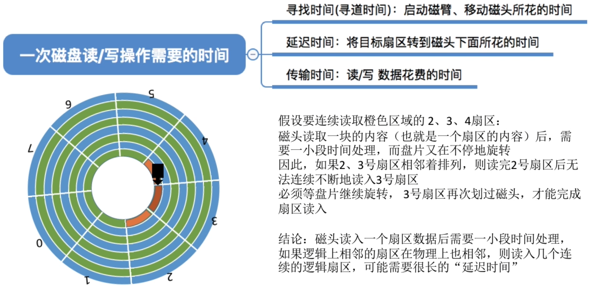
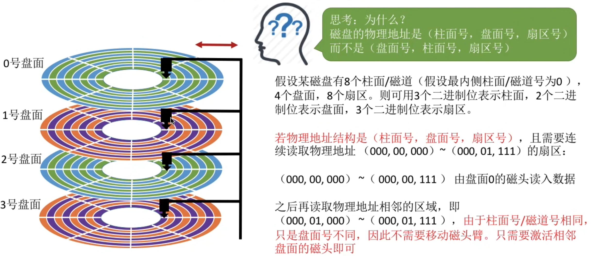
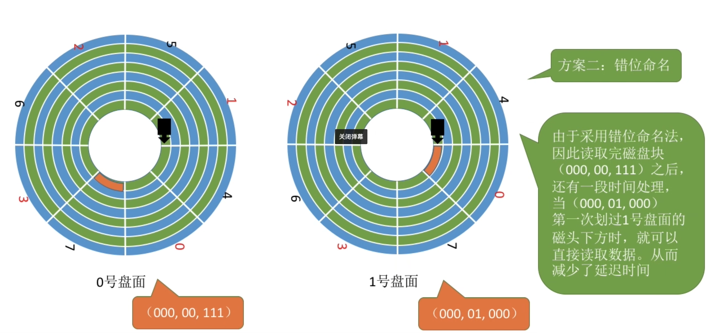
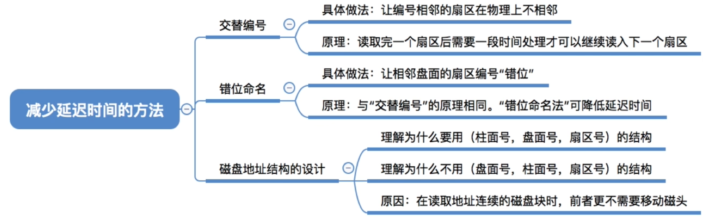

- [前情回顾](#前情回顾)
- [减少延迟时间的方法: 交替编号](#减少延迟时间的方法-交替编号)
- [磁盘地址结构的设计](#磁盘地址结构的设计)
- [减少延迟时间的方法: 错位命名](#减少延迟时间的方法-错位命名)
- [知识回顾与重要考点](#知识回顾与重要考点)

# 前情回顾

# 减少延迟时间的方法: 交替编号
若采用交替编号的策略, 即让逻辑上相邻的扇区在物理上有一定的间隔, 可以使读取连续的逻辑扇区所需的延迟时间更小

# 磁盘地址结构的设计

所以, 在读取地址连续的磁盘块时,采用(柱面号, 盘面号, 扇区号)的地址结构可以减少磁盘移动消耗的时间

# 减少延迟时间的方法: 错位命名

指的是相同的柱面对应不同的扇区

# 知识回顾与重要考点
