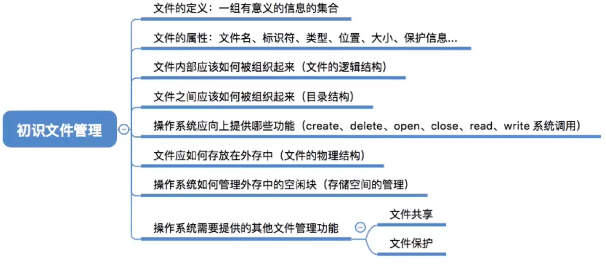

- [文件的属性](#文件的属性)
- [文件内部的数据应该怎样组织起来?](#文件内部的数据应该怎样组织起来)
- [操作系统应该向上提供哪些功能?](#操作系统应该向上提供哪些功能)
  - [其他需要有操作系统实现的文件管理功能](#其他需要有操作系统实现的文件管理功能)
- [知识点回顾与重要考点](#知识点回顾与重要考点)

# 文件的属性
- <mark>文件名</mark>：由创建文件的用户决定文件名，主要是为了方便用户找到文件，<mark>同一目录下不允许有重名文件。</mark>
- <mark>标识符</mark>：一个系统内的各文件内标识符唯一，对用户来说毫无可读性，因此标识符知识操作系统用于区分各个文件的一种内部名称。
- <mark>类型</mark>：指明文件的类型
- <mark>位置</mark>：文件存放的路径（让用户使用）、对外部中的地址（操作系统使用，对用户不可见）
- <mark>大小</mark>：指明文件大小
- <mark>创建时间、上次修改时间、文件所有者信息</mark>
- <mark>保护信息</mark>：对文件进行保护的访问控制信息

# 文件内部的数据应该怎样组织起来?
无结构文件(如文本文件)--由一些二进制或字符流组成,又称"流式文件"

有结构文件(如数据库表)--由一组相似的记录组成,又称"记录式文件"

记录是一组相关数据项的集合

数据项是文件系统中最基本的数据单位

# 操作系统应该向上提供哪些功能?
- 最基本的功能
  - 创建文件(create系统调用)
  - 删除文件(delete系统调用)
  - 读文件(read系统调用)
  - 写文件(write系统调用)
  - 打开文件(open系统调用)
  - 关闭文件(close系统调用)

读写文件之前,需要"打开文件"\
读写文件之后,需要"关闭文件"

## 其他需要有操作系统实现的文件管理功能
- 文件共享: 使多个用户可以共享一个文件
- 文件保护: 如何保证不同的用户对文件有不同的操作权限

# 知识点回顾与重要考点
