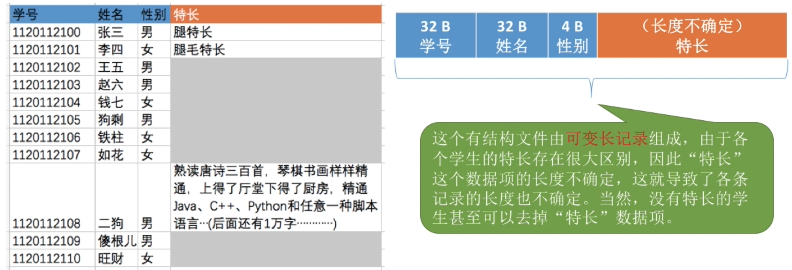
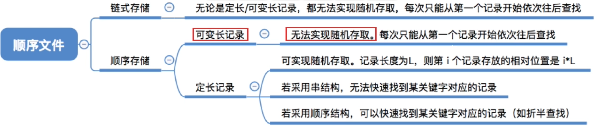
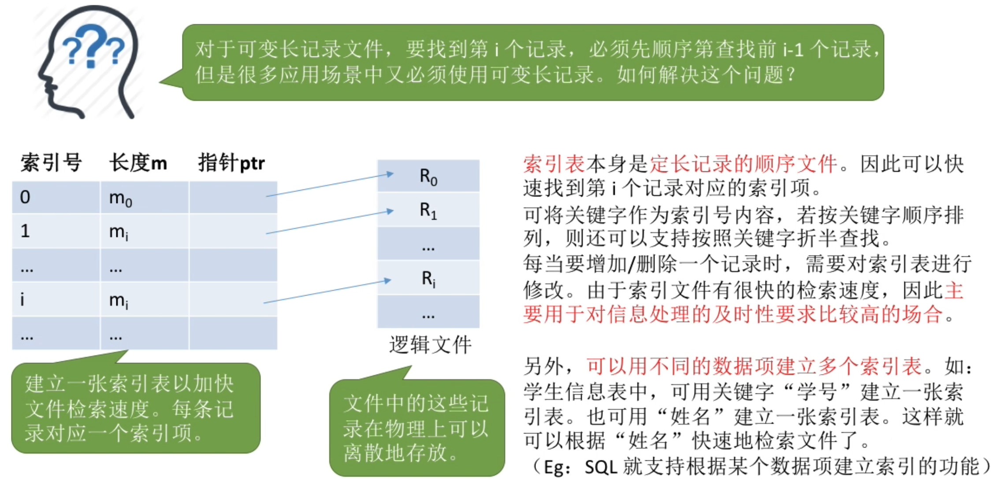
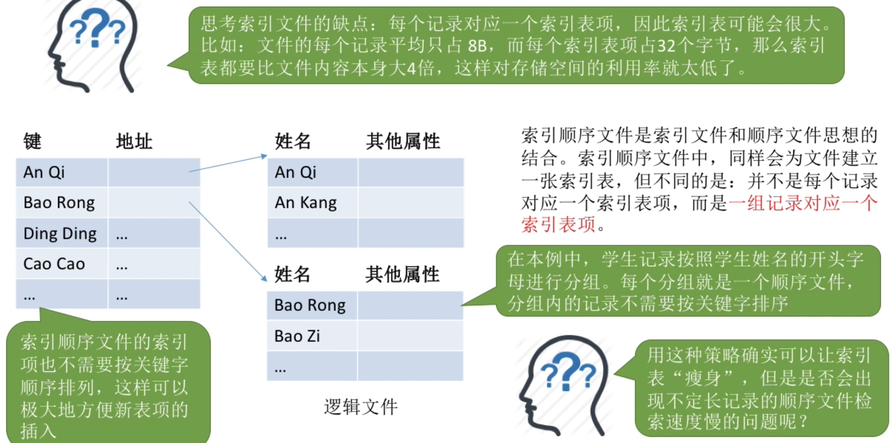
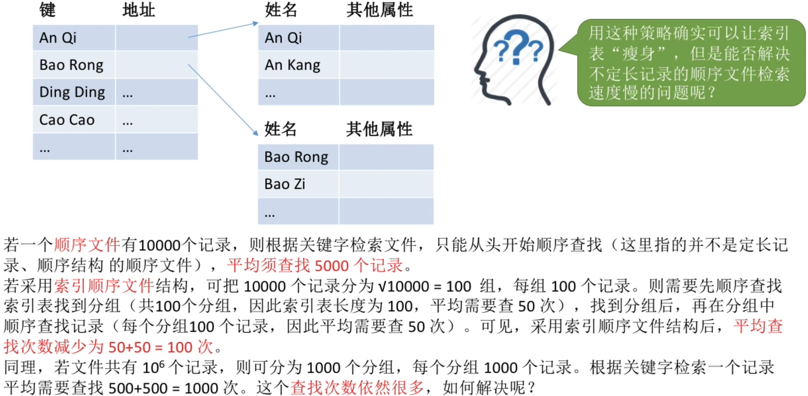
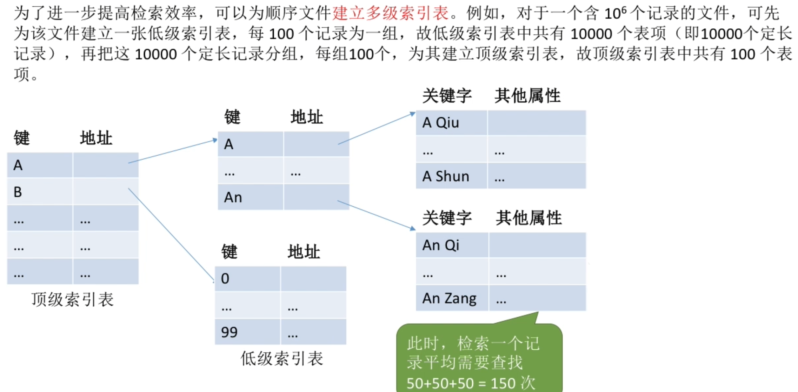
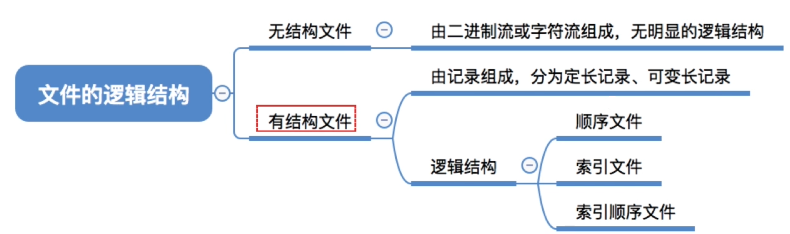
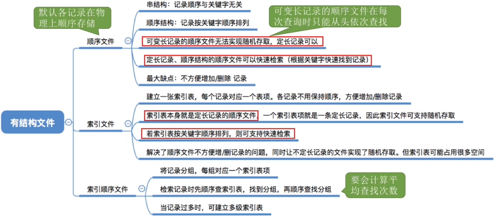

- [顺序文件](#顺序文件)
- [索引文件](#索引文件)
- [索引顺序文件](#索引顺序文件)
  - [检索效率分析](#检索效率分析)
- [多级索引顺序文件](#多级索引顺序文件)
- [知识点回顾与重要考点](#知识点回顾与重要考点)

# 顺序文件

如果考题中出现"顺序文件",那么指的就是物理上顺序存储的顺序文件

# 索引文件

# 索引顺序文件

## 检索效率分析

# 多级索引顺序文件

# 知识点回顾与重要考点

