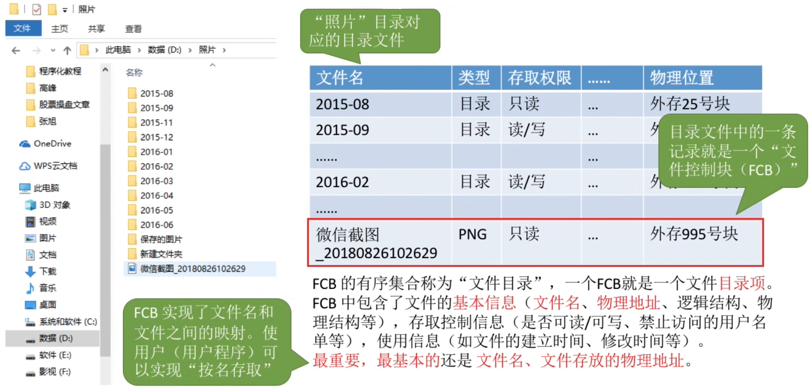
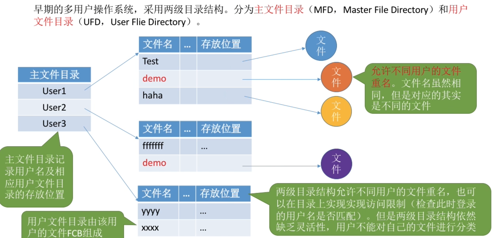
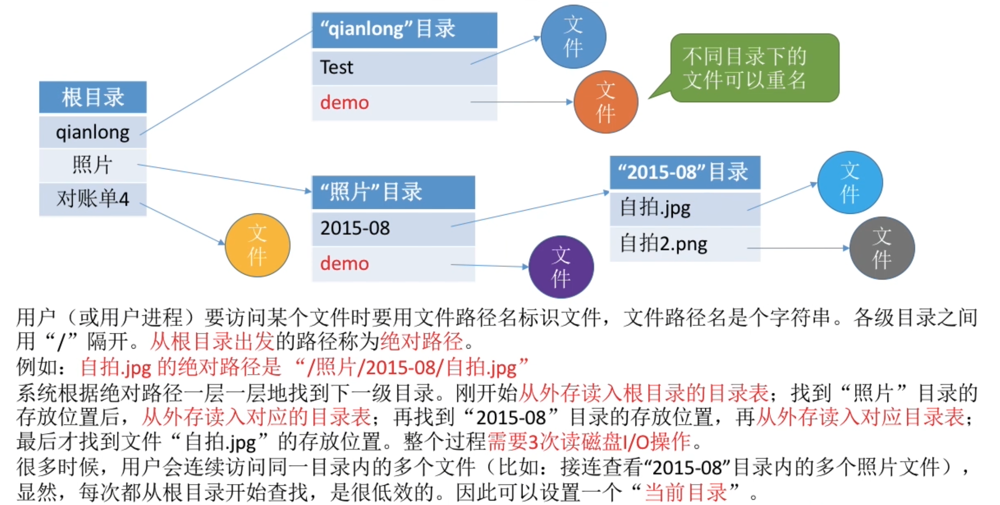
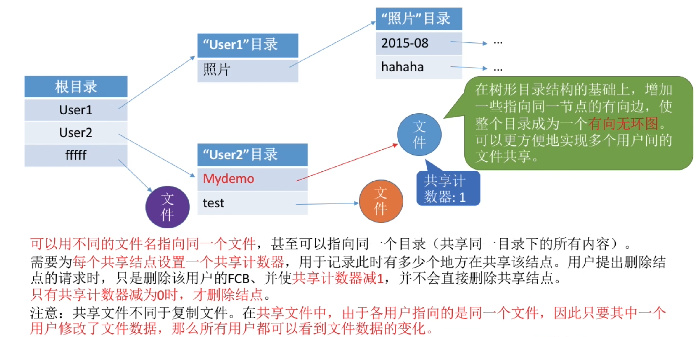
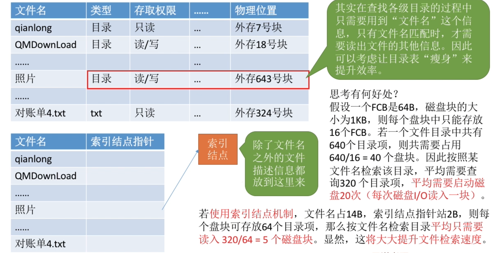
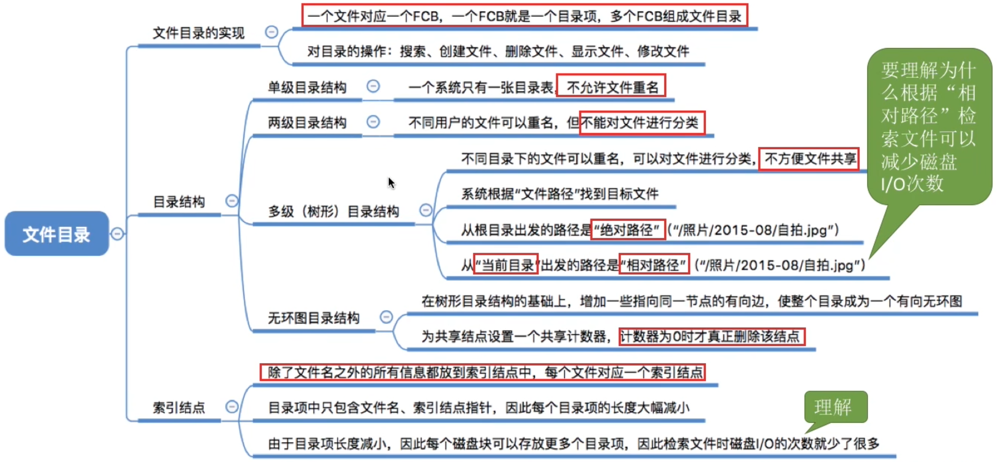

- [文件控制块](#文件控制块)
    - [需要对目录进行哪些操作?](#需要对目录进行哪些操作)
- [目录结构--单级目录结构](#目录结构--单级目录结构)
- [目录结构--两级目录结构](#目录结构--两级目录结构)
- [目录结构--多级目录结构(又称树形目录结构)](#目录结构--多级目录结构又称树形目录结构)
- [目录结构--无环图目录结构](#目录结构--无环图目录结构)
- [索引结点](#索引结点)
- [知识回顾与重要考点](#知识回顾与重要考点)

# 文件控制块
当我们双击打开目录的时候\
操作系统在背后做的事情是:

    查询这个根目录的目录文件，找到照片这个文件对应的目录项。
    根据这个目录项当中记录的 文件的存放位置 从外存当中读入照片这个目录文件的数据
    这样就可以知道照片这个目录下面还有哪些内容

### 需要对目录进行哪些操作?
- 搜索：当用户要使用一个文件时，系统要根据文件名搜索目录，找到该文件对应的目录项
- 创建文件：创建一个新文件时，需要在其所属的目录中增加一个目录项。
- 删除文件：当删除一个文件时，需要在目录中删除相应的目录项。
- 显示目录：用户可以请求显示目录的内容，如显示该目录中的所有文件及相应属性
- 修改目录：某些文件属性保存在目录中，因此这些属性变化是需要修改相应的目录项（如：文件重命名）

# 目录结构--单级目录结构
早期操作系统并不支持多级目录, 整个操作系统中只建立一张目录表, 每个文件占一个目录项.

单目录实现了"按名存取"，但是不允许文件重名。

在创建一个文件时，需要先检查目录表中有没有重名文件，确定不重名之后才能允许建立文件，并将新文件对应的目录项插入目录表中。

显然，单级目录结构不适用于多用户操作系统

# 目录结构--两级目录结构
早期的多用户目录结构，采用两级目录结构。分为<mark>主文件目录</mark>和<mark>用户文件目录</mark>

# 目录结构--多级目录结构(又称树形目录结构)

# 目录结构--无环图目录结构

# 索引结点

# 知识回顾与重要考点
