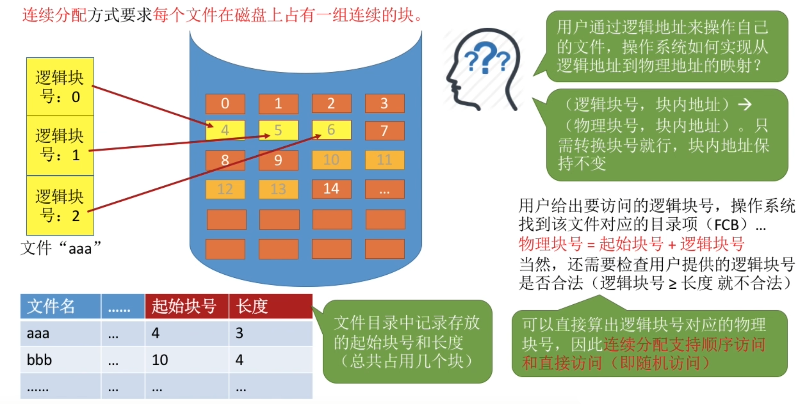
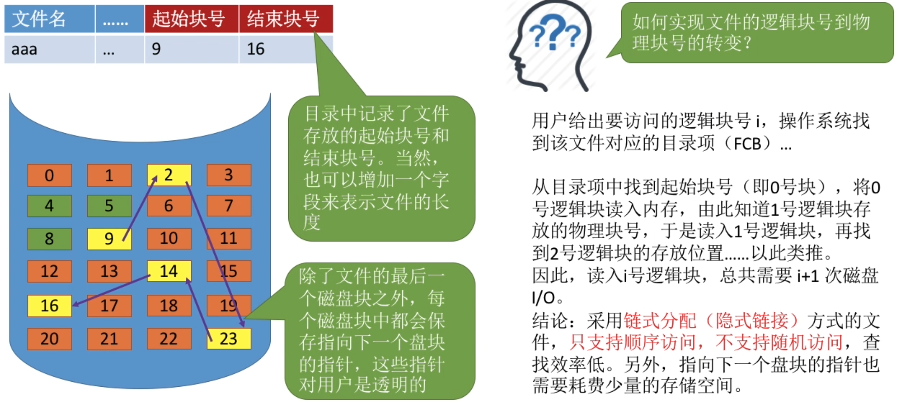
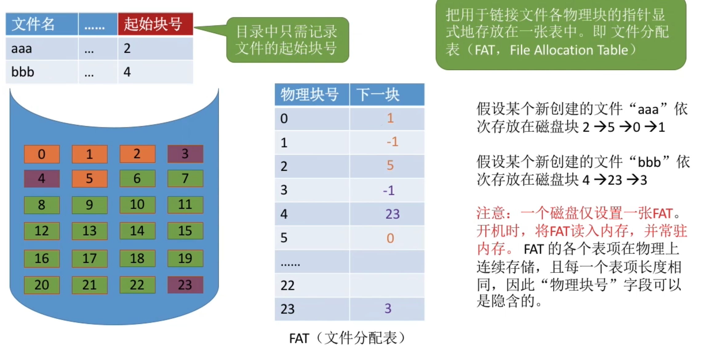
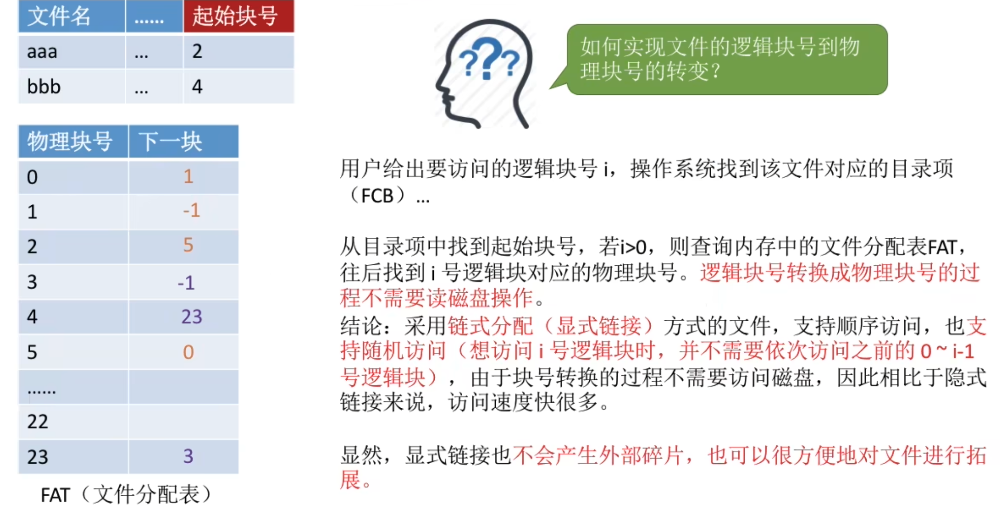
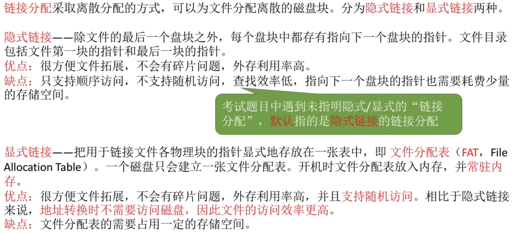

- [文件块、磁盘块](#文件块磁盘块)
- [文件分配方式--连续分配](#文件分配方式--连续分配)
    - [连续分配(总结)](#连续分配总结)
- [链接分配--隐式链接](#链接分配--隐式链接)
- [链接分配--显式链接](#链接分配--显式链接)
- [链接分配总结](#链接分配总结)

# 文件块、磁盘块
在内存管理中，进程的逻辑地址空间被分为一个一个页面\
同样的，在外存管理中，为了方便对文件数据的管理，文件的逻辑地址空间被分为了一个一个的文件“块”。\
于是文件的逻辑地址也可以表示为（逻辑块号，块内地址）的形式。

若块的大小是1KB，则1MB大小的文件可以被分为1K个块

- 操作系统为文件分配存储空间都是以块为单位的
- 用户通过逻辑地址来操作自己的文件，操作系统要负责实现从逻辑地址到物理地址的映射。

# 文件分配方式--连续分配

<mark>连续分配</mark>方式要求<mark>每个文件在磁盘上占有一组连续的块</mark>./
读取某个磁盘块时,需要移动磁头.访问的两个磁盘块相隔越远,移动磁头所需的时间就越长.

结论: 连续分配的文件在顺序读/写时速度最快.

连续分配方式的缺点: 

因为连续分配方式要求每个文件在磁盘上占有一组连续的块.

如果一个连续存储的文件想要扩展它的内存大小,而这个文件后面的区域已经没有空闲的块,此时就需要将该文件全部迁移到一个连续的空闲区域中.

这么做的代价是很高的

结论: 物理上采用连续分配的文件不方便拓展, 这样做会产生难以利用的磁盘碎片\
可以用紧凑来处理碎片,但是需要耗费很大的时间代价

### 连续分配(总结)
- 优点: 支持顺序访问和直接访问(随机访问);连续分配的文件在顺序访问时速度最快
- 缺点: 不方便文件拓展;存储空间利用率低, 会产生磁盘碎片

# 链接分配--隐式链接

隐式链接的链接分配方式,可以很方便文件拓展.
另外,所有的空闲磁盘块都可以被利用,<mark>不会有碎片问题,外存利用率高</mark>

# 链接分配--显式链接

# 链接分配总结
