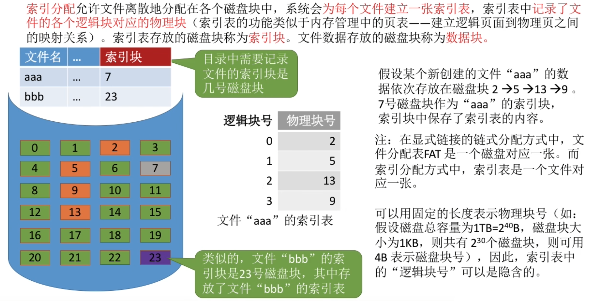
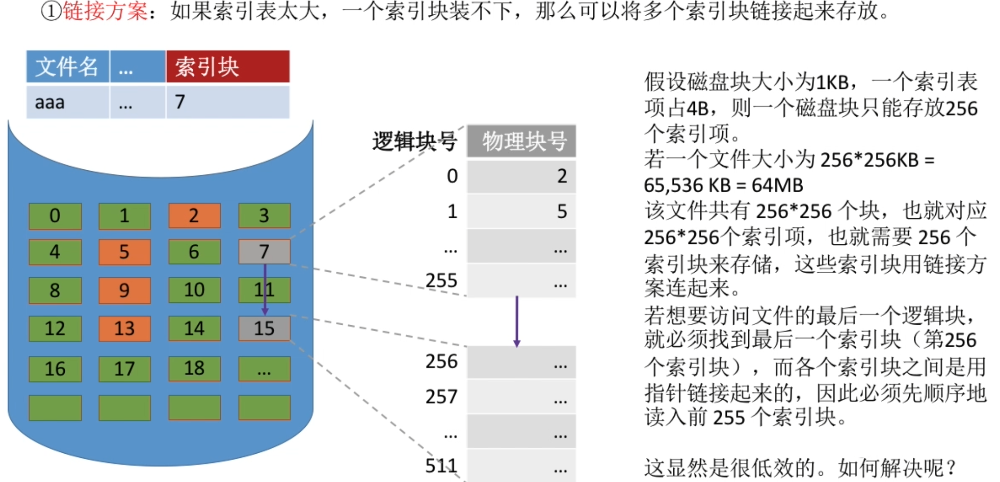
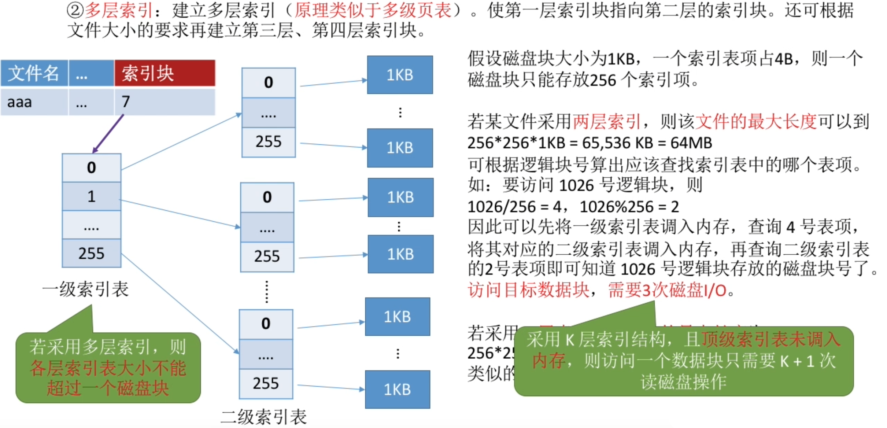
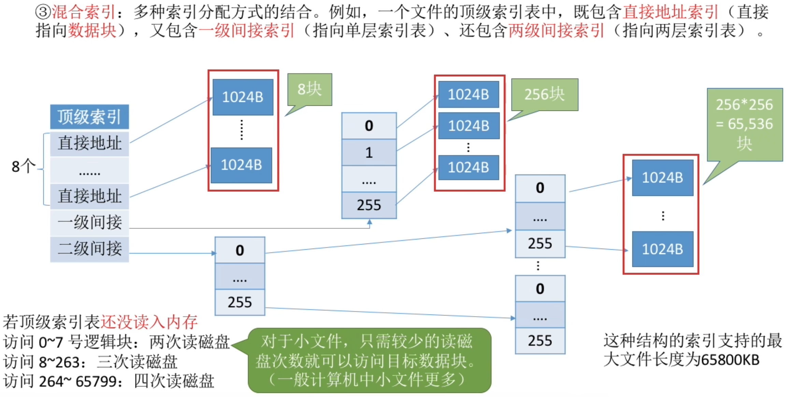
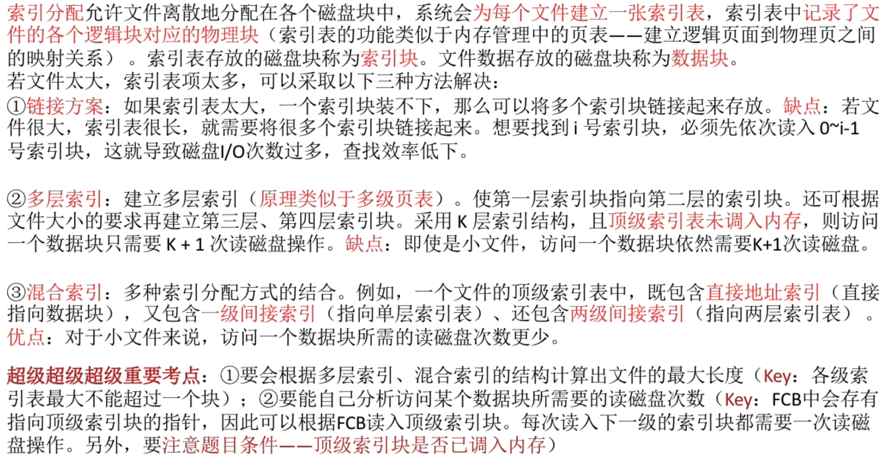
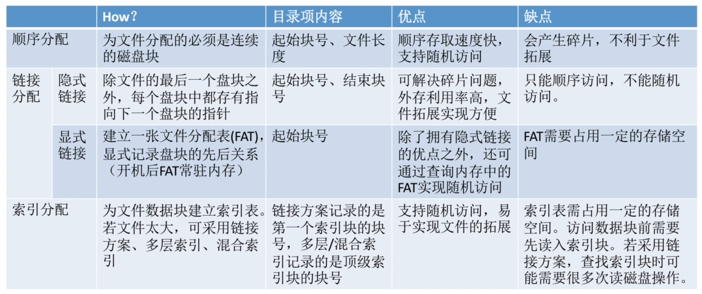

- [文件分配方式--索引分配](#文件分配方式--索引分配)
    - [索引分配--链接方案](#索引分配--链接方案)
    - [索引分配--多层索引](#索引分配--多层索引)
    - [索引分配--混合索引](#索引分配--混合索引)
- [索引分配(总结)](#索引分配总结)
- [知识回顾与重要考点](#知识回顾与重要考点)

# 文件分配方式--索引分配

每个<mark>文件</mark>对应自己的一张<mark>索引表</mark>, 索引表中根据<mark>逻辑地址(逻辑块号)</mark>存储着对应的<mark>物理块号</mark>\
<mark>文件</mark>通过<mark>索引块</mark>在<mark>外存</mark>中找到该<mark>文件</mark>的<mark>索引表</mark>\
以此来访问逻辑块在外存中的存放位置

### 索引分配--链接方案

### 索引分配--多层索引

如果需要访问的这个数据很小,读入的这个数据的次数依然需要k+1次, 那么会造成额外调用IO操作导致性能降低的情况

### 索引分配--混合索引

# 索引分配(总结)

# 知识回顾与重要考点
