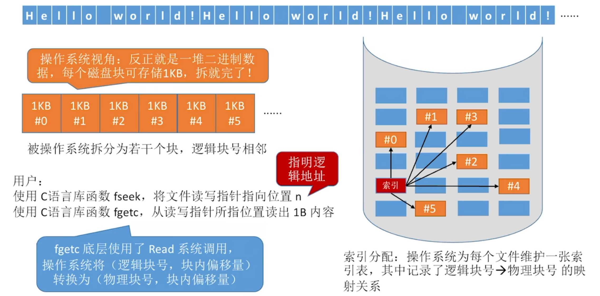
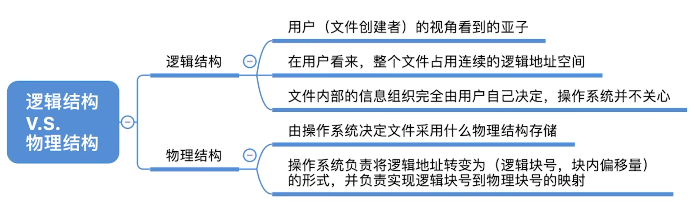
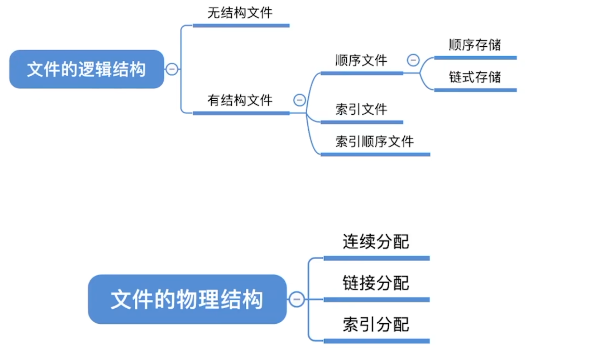

- [物理结构(从操作系统视角看)](#物理结构从操作系统视角看)
  - [链接存储的顺序文件采用链接分配](#链接存储的顺序文件采用链接分配)
- [知识总结](#知识总结)

# 物理结构(从操作系统视角看)

不管系统如何使用函数, 都只是指明的逻辑地址, 底层的OS根据逻辑地址和块内偏移量来查找所需修改的数据的物理块地址.\
不管OS采用什么存储的分配方式

## 链接存储的顺序文件采用链接分配
文件内部各条记录链式存储: 由创建文件的用户自己设计\
文件整体用链接分配: 由操作系统决定

# 知识总结

