- [存储空间的划分与初始化](#存储空间的划分与初始化)
- [存储空间管理--空闲表法](#存储空间管理--空闲表法)
- [存储空间管理--空闲链表法](#存储空间管理--空闲链表法)
  - [空闲盘块链](#空闲盘块链)
  - [空闲盘区链](#空闲盘区链)
- [存储空间管理--位示图法](#存储空间管理--位示图法)
- [存储空间管理--成组链接法](#存储空间管理--成组链接法)
- [知识点回顾与重要考点](#知识点回顾与重要考点)

# 存储空间的划分与初始化
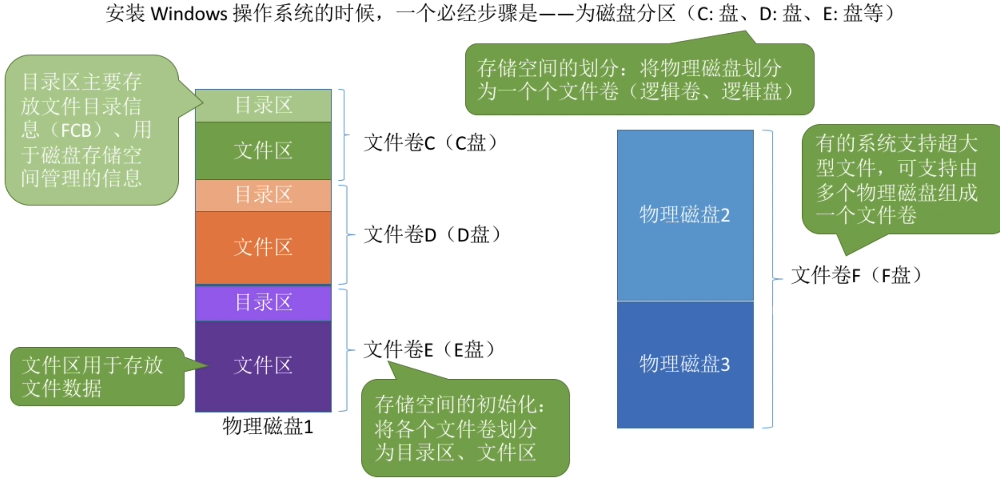

# 存储空间管理--空闲表法
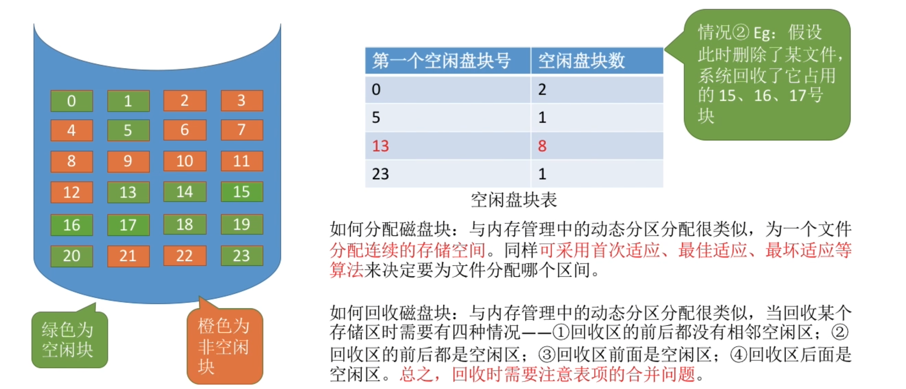

# 存储空间管理--空闲链表法
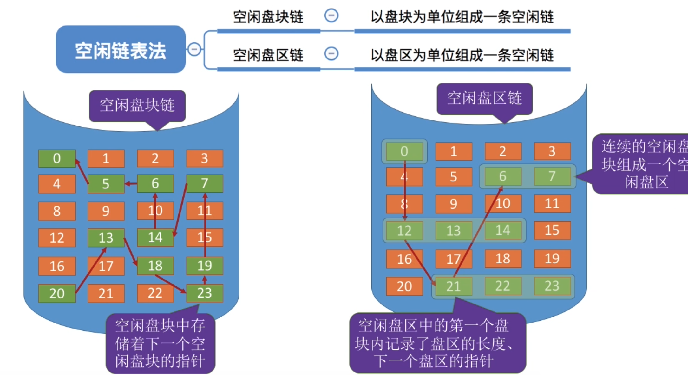

## 空闲盘块链
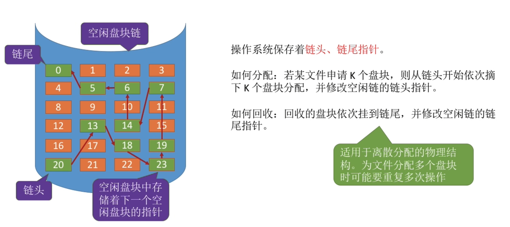

## 空闲盘区链
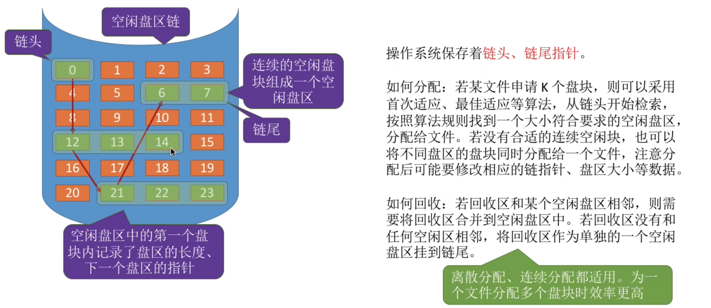

# 存储空间管理--位示图法
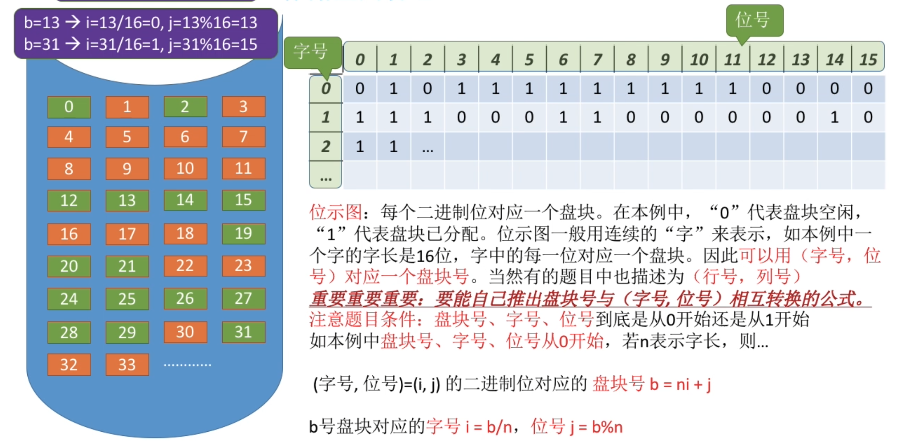

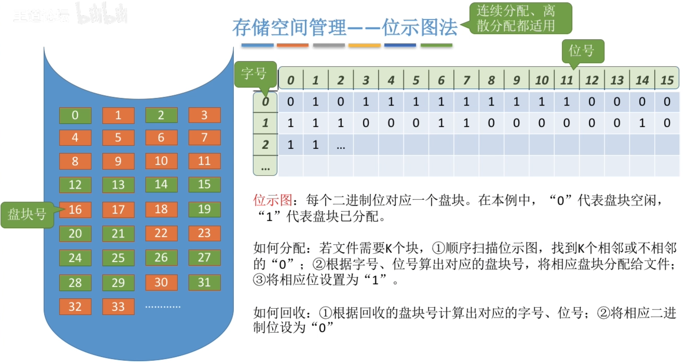

# 存储空间管理--成组链接法
空闲表法、空闲链表法不适用于大型文件系统，因为空闲表或空闲链表可能过大。NUIX系统中采用了成组链接法对磁盘空闲块进行管理。

文件卷的目录区中专门用一块磁盘块作为“超级块”，当系统启动时，需要将超级块读入内存。并且要保证内存与外存中的“超级块”数据一致。
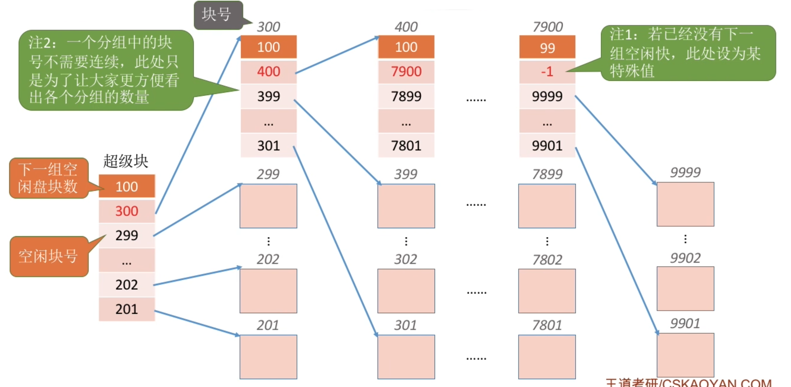

如何分配?
1. 检查第一个分组的块数是否足够。$1 < 100$,因此是足够的.
2. 分配以第一个分组中的1个空闲块,并修改对应数据

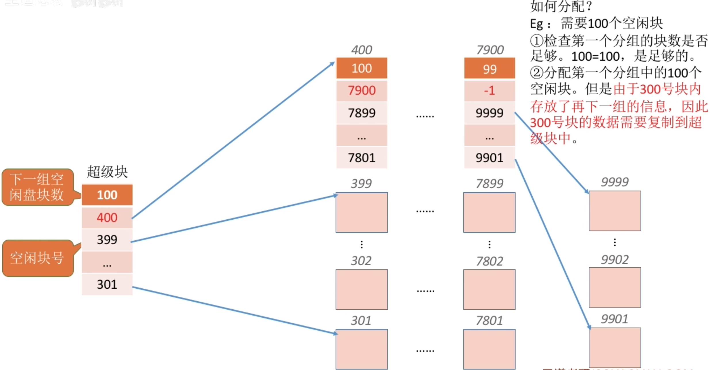

回收

如果分组块没满, 就直接插入\
超级块的指针需要永远指向第一个分组
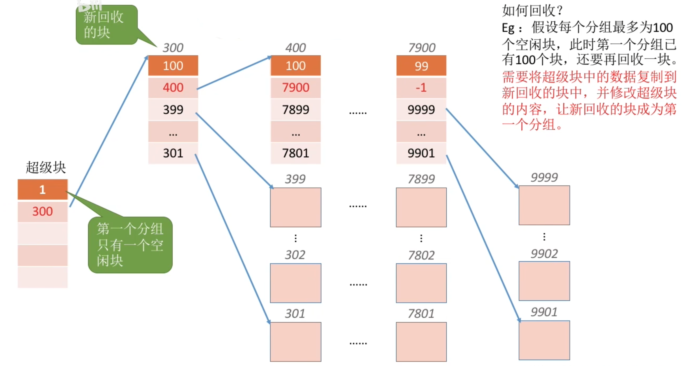

# 知识点回顾与重要考点
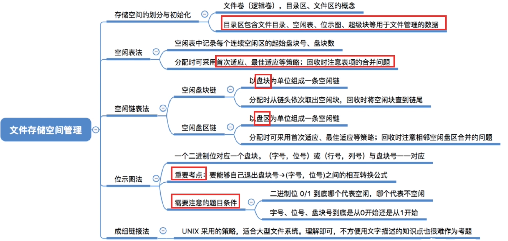