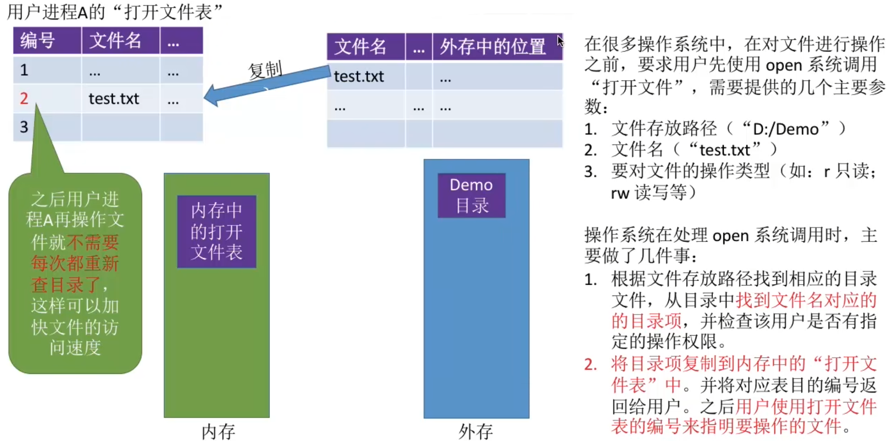
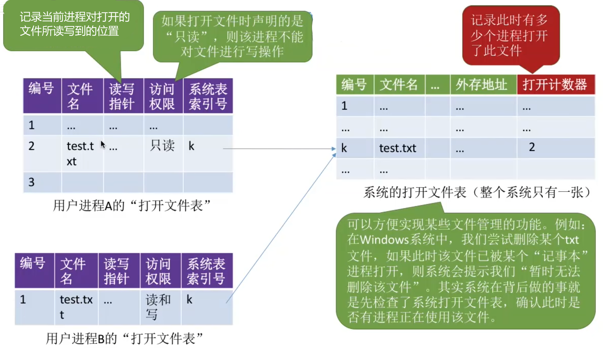
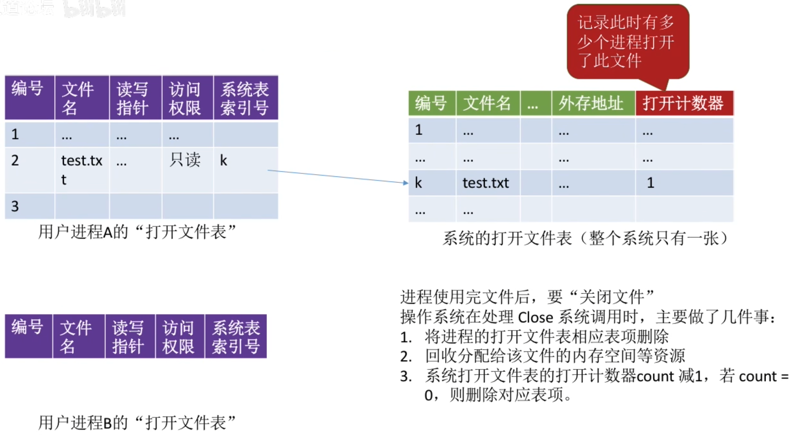
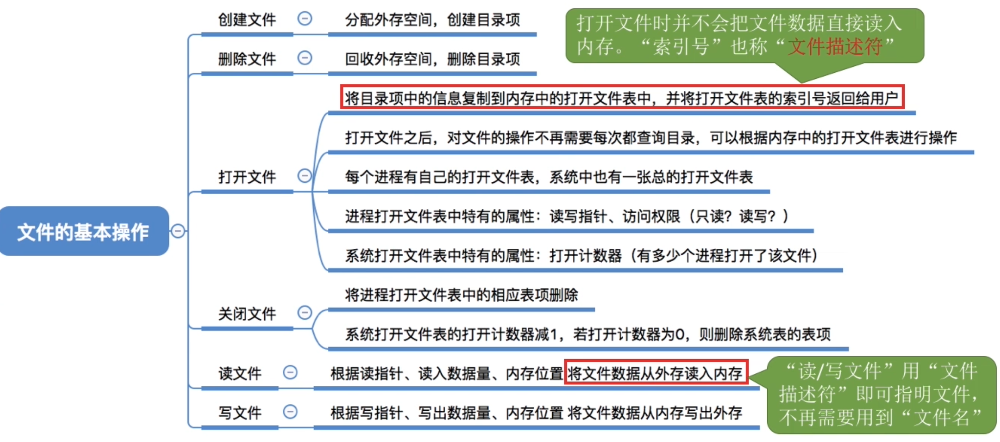

- [创建文件](#创建文件)
- [删除文件](#删除文件)
- [打开文件](#打开文件)
- [关闭文件](#关闭文件)
- [读文件](#读文件)
- [写文件](#写文件)
- [知识点回顾与重要考点](#知识点回顾与重要考点)

# 创建文件
在Windows创建文件时, 系统背后调用了"create系统调用"

进行create系统调用时，需要提供的几个参数：
1. 所需的外存空间大小(如: 一个盘块, 即1KB)
2. 文件存放路径("D:/Demo")
3. 文件名("这个地方默认为新建文本文档.txt")

操作系统在处理create系统调用时,主要做了两件事情
1. <mark>在外存中找打文件所需的空间</mark>(结合上节学习的空闲链表法、位示图、 成组链接法等管理策略，找到空闲空间)
2. 根据文件存放路径的信息找到该目录对应的目录文件（此处就是D:/Demo目录），在目录中创建该文件对应的目录项。目录项中包含了文件名、文件在外存中的存放位置等信息。

# 删除文件
当在Windows操作系统的图形化界面点击了"**删除**"之后,图形化交互进程通过OS提供的"**删除文件**"功能, 即delete系统调用, 将文件数据从外存中删除

进行Delete系统调用时, 需要提供的几个主要参数:
1. 文件存放路径("D:/Demo")
2. 文件名("test.txt")

OS在处理Delete系统调用时, 主要做了几件事情:
1. 根据文件存放路径找到相应的目录文件, 从目录中**找到文件名对应的目录项**.
2. 根据该目录项记录的文件在外存的存放位置、文件大小等信息，**回收文件占用的磁盘块**。（回收磁盘时，根据空闲表法、空闲链表法、位图法等管理策略的不同，需要做不同的处理）
3. 从目录表中**删除文件对应的目录项**

# 打开文件
<mark>OS会根据我们提供的文件存放路径, 在**外存**中找到这个目录对应的目录表</mark>\
表中的一行即为**目录项**

# 关闭文件

# 读文件
读文件需要将文件数据读入内存, 才能让CPU处理(双击后, "记事本"应用程序通过OS提供的"读文件"功能,即read系统调用, 将文件数据从外存读入内存, 并显示在屏幕上)

进程使用 read系统调用完成写操作。需要指明是哪个文件(在支持“打开文件”操作的系统中，只需要提供文件在打开文件表中的索引号即可)，还需要指明要读入多少数据(如: 读入 1KB)、指明读入的数据要放在内存中的什么位置。\
操作系统在处理 read 系统调用时，会从读指针指向的外存中，将用户指定大小的数据读入用户指定的内存区域中。
# 写文件
进程使用write系统调用完成写操作，需要指明是哪个文件(在支持“打开文件”操作的系统中，只需要提供文件在打开文件表中的索引号即可)，还需要指明要写出多少数据(如: 写出 1KB)、写回外存的数据放在内存中的什么位置\
操作系统在处理 write 系统调用时，会从用户指定的内存区域中，将指定大小的数据写回写指针指向的外存。

# 知识点回顾与重要考点
