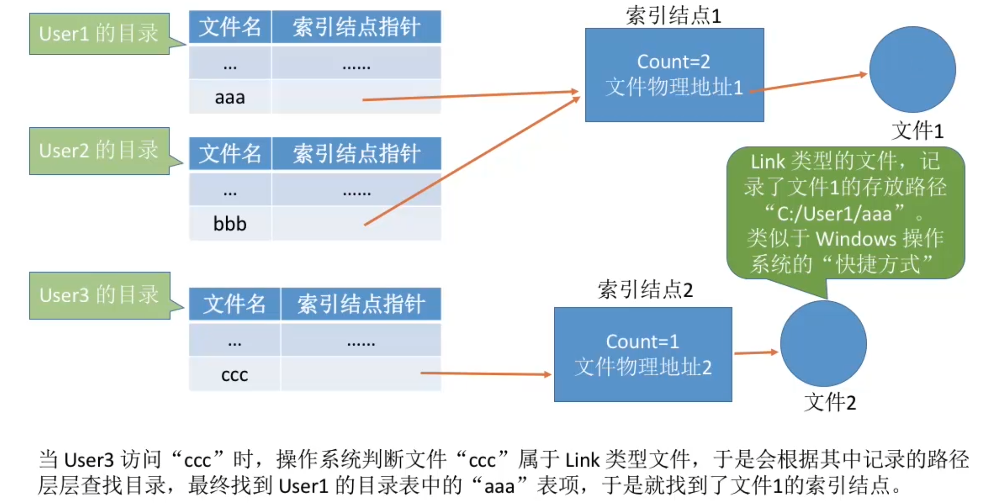
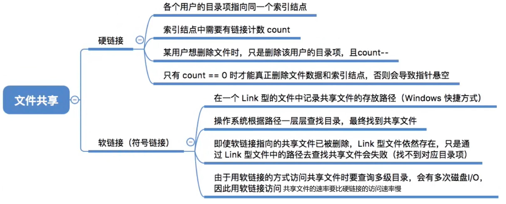

- [基于索引节点的共享方式(硬链接)](#基于索引节点的共享方式硬链接)
- [基于符号链的共享方式(软链接)](#基于符号链的共享方式软链接)
- [知识点回顾与重要考点](#知识点回顾与重要考点)

# 基于索引节点的共享方式(硬链接)
知识回顾: 索引节点,是一种文件目录瘦身策略。由于检索文件时只需要 用到文件名，因此可以将除了文件名之外的其他信息放到索引节点中。这样目录项就只需要包含文件名、索引结点指针。

索引结点中设置一个链接计数变量count，用于表示链接到本索引结点上的目录项数。\
若count=2，说明此时有两个用户目录项链接到该索引结点上，或者说有两个用户在共享此文件。
- 索引结点指向一个文件
- 不同目录下的文件想要访问该文件就可以建立一个索引结点指针指向索引结点
- 这样不同路径下的文件可以同名,也可以不同名,指向的都是同一个文件

如果想要删除这个文件, 只是删除了该文件的索引结点指针,只有索引结点的count值为0,才能将该文件删除(索引结点和文件数据)
# 基于符号链的共享方式(软链接)

- 记录目标文件的存放路径
- 存放路径的文件称为link文件类型
- 根据存放路径可以找到目标文件

# 知识点回顾与重要考点
