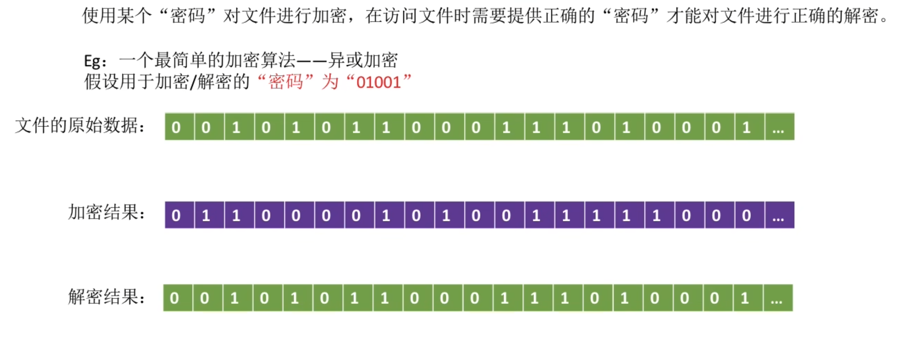
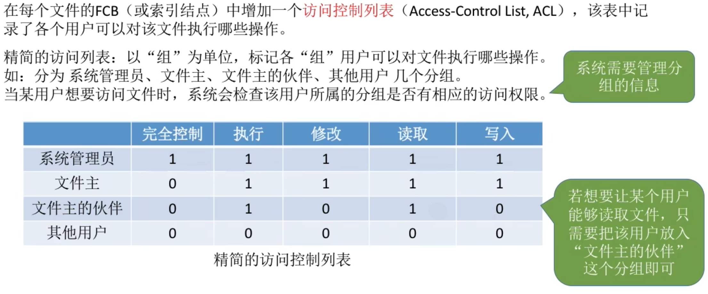
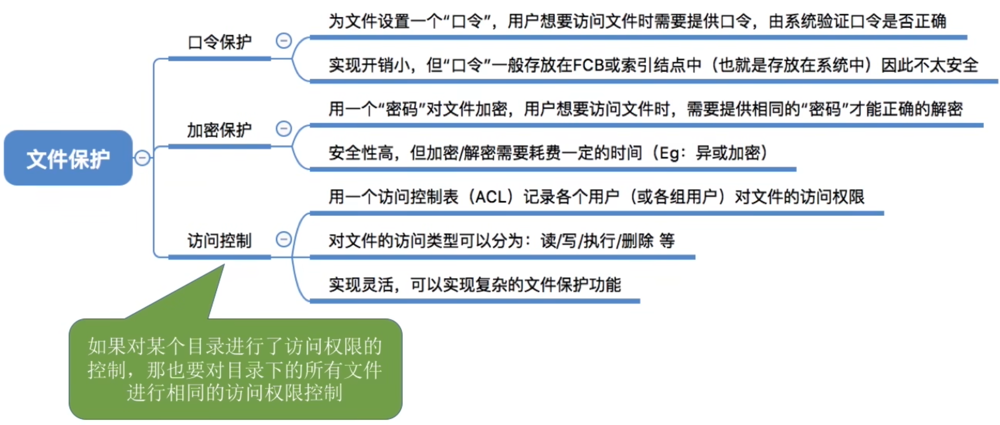

- [总览](#总览)
- [口令保护](#口令保护)
- [加密保护](#加密保护)
- [访问控制](#访问控制)
- [知识点回顾与重要考点](#知识点回顾与重要考点)

# 总览
文件保护分为
1. 口令保护
2. 加密保护
3. 访问控制

# 口令保护
为文件设置一个"口令"(如: abc112233),用户请求访问该文件时必须提供"口令"

口令一般存放在文件对应的FCB或者索引结点中.用户访问文件前需要先输入"口令",操作系统会将用户提供的口令与FCB中存储的口令进行对比,如果正确允许该用户访问文件.

优点: 保存口令的空间开销不多,验证口令的时间开销也很小.
缺点: 正确的"口令"存放在系统内部,不够安全

# 加密保护
使用某个密码对文件进行加密, 在访问文件时需要提供正确的密码才能对文件进行正确的解密

优点: 保密性强, 不需要在系统中存储"密码"\
缺点: 编码/译码, 或者说加密/解密要花费一段时间

# 访问控制
在每个文件的FCB(或索引结点)中增加一个访问控制列表, 该表中记录了各个用户可以对该文件执行哪些操作

# 知识点回顾与重要考点
