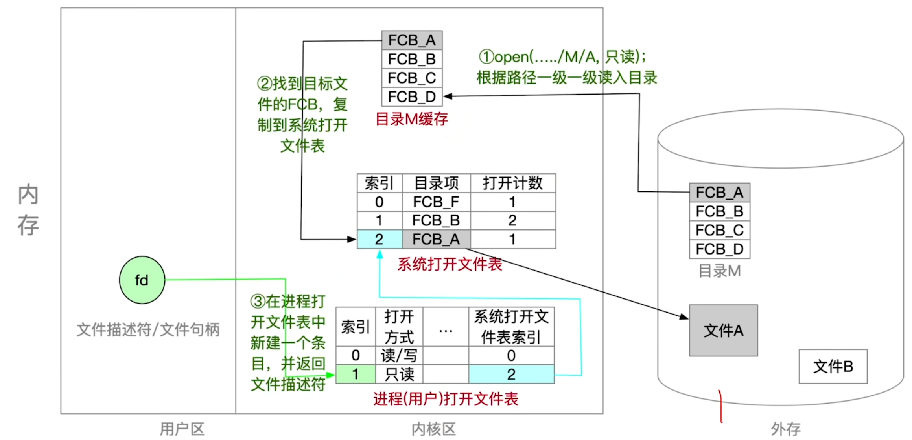

- [磁盘出厂步骤](#磁盘出厂步骤)
- [原始磁盘](#原始磁盘)
- [逻辑格式化](#逻辑格式化)
- [文件系统在内存中的结构](#文件系统在内存中的结构)
- [open系统调用打开文件的背后过程](#open系统调用打开文件的背后过程)

# 磁盘出厂步骤
1. 物理格式化
2. 逻辑格式化

# 原始磁盘
一个磁盘刚被生产出来的时候, 会进行一次**物理格式化**\
同时,在物理格式化的时候, 会检查一个一个的扇区.\
如果出现**坏扇区**, 就会使用**备用扇区**来顶替**坏扇区**

# 逻辑格式化
一个磁盘会被划分为多个分区
- 空闲空间管理`判断一个特定的磁盘块此时到底是否空闲`
- 超级块`迅速的找到若干个空闲的盘块`
- i节点区`索引结点, 每个文件都对应着一个索引结点. NUIX文件系统中, 所有的索引结点都是连续存放在i节点区的`\
  所有索引节点的大小都是相同的, 可以认为i节点区是一个巨大的数组, OS可以通过特定的下标来访问任何一个索引结点存储的位置
- 根目录`完成逻辑格式化后, 建立根目录`
- <mark>灰色的部分</mark>就是逻辑格式化之后填充进的数据
- <mark>白色的区域</mark>在逻辑格式化后默认是为空的

“主引导记录MBR、引导块”的作用，可以结合第一章”操作系统引导“小节来学习

# 文件系统在内存中的结构
近期访问过的目录文件会缓存在内存中，被称为**文件的缓存**，这样不用每次都从磁盘读入，这样可以加快目录检索速度
- 系统打开文件表\
  整个系统只有一张
- 进程打开文件表\
  每个进程都会有一张, 包含在每个进程的PCB中, 记录了每个进程当前打开了哪些文件

文件系统在内存中的结构分为3个:
1. 目录的缓存
2. 系统打开文件表
3. 进程打开文件表

# open系统调用打开文件的背后过程
