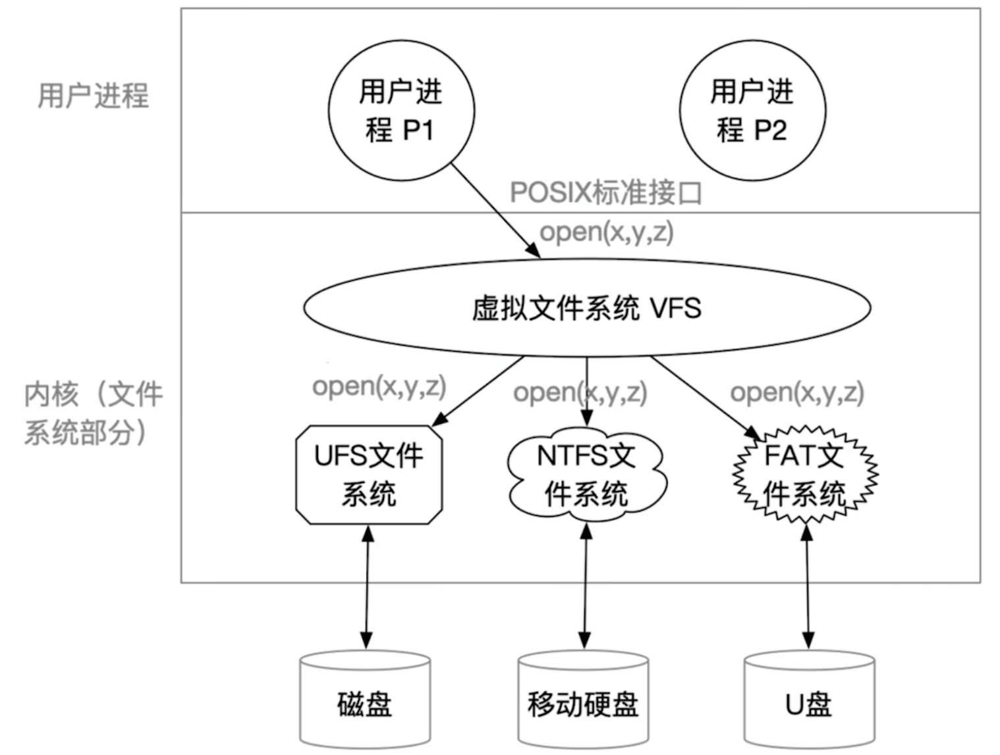
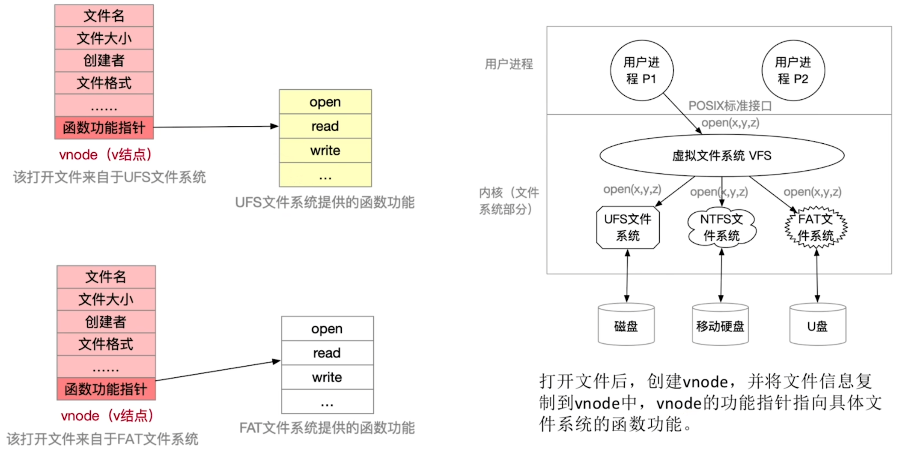

- [普通的文件系统](#普通的文件系统)
- [虚拟文件系统](#虚拟文件系统)
- [文件系统挂载(mounting)](#文件系统挂载mounting)

# 普通的文件系统
正常的计算机内部, 有可能会出现各种各样的文件系统

比如一个电脑中有着`磁盘,移动硬盘,U盘`这些文件系统,并且这些文件系统有着不同的open系统调用, 这时就需要使用`虚拟文件系统VFS`来对这些文件系统进行同一的系统调用

# 虚拟文件系统

所以虚拟文件系统的特点是: 
1. 向上层用户进程提供统一标准的系统调用接口,屏蔽底层具体文件系统的实现差异
2. VFS要求下层的文件系统必须实现某些规定的函数功能, 如: open/read/write.\
   一个新的文件系统想要在某操作系统上被使用,就必须满足该操作系统VFS的要求
3. 没打开一个文件,VFS就在主存中新建一个vnode,用统一的数据结构表示文件, 无论该文件存储在哪个文件系统.

注意: vnode只存在主存中,而inode即会被调入主存, 也会在外存中存储
```
主存就是内存
辅存就是外存
```


# 文件系统挂载(mounting)
文件系统挂载需要做的事情:
1. 将文件的相关信息添加到内存中的`挂载表`中
2. 需要为VFS提供自己的`函数地址列表`
3. 将新文件系统加到挂载点, 也就是将新文件系统挂载在某个父目录下