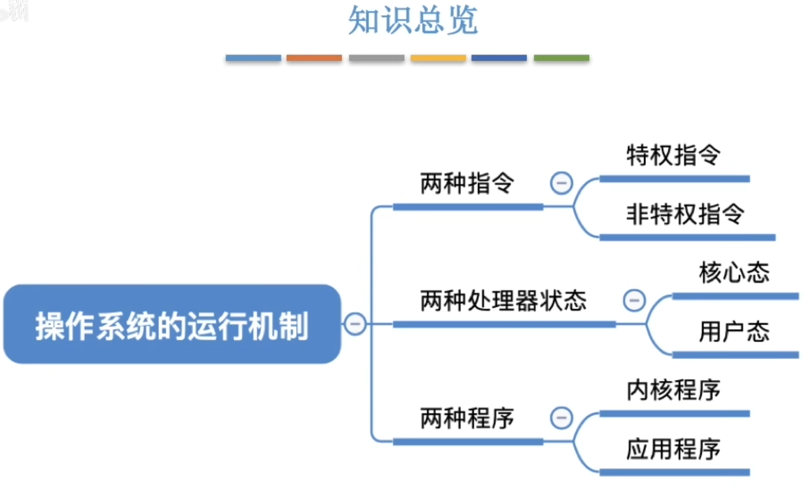
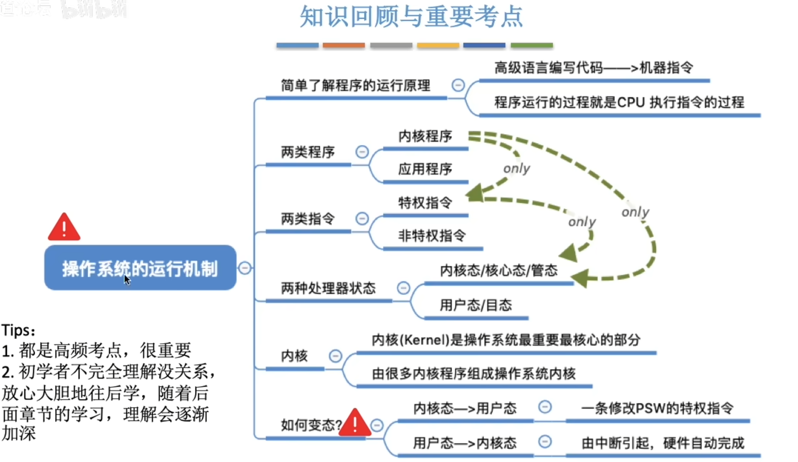

<h3>程序是如何运行的?</h3>

程序运行的过程其实就是CPU执行一条一条的机器指令的过程\
"指令"就是处理器(cpu)能识别、执行的最基本命令\
bash界面中输入的命令其实是`交互式命令接口`, 本节的`指令`指的是二进制机器指令

# 内核程序&应用程序
普通程序员写的基于操作系统之上运行的就是"应用程序"\

微软、苹果有一部分负责实现操作系统，他们写的就是“内核程序”\
有很多内核程序组成了"操作系统内核", 或简称"内核(Kernel)"\
`内核`是操作系统最重要最核心的部分, 也就是最接近硬件的部分\
甚至可以说, 一个操作系统只要有内核就够了\
操作系统的功能未必都在内核中, 如图形化界面GUI

# 特权指令&非特权指令
操作系统内核作为"管理者", 有时会让CPU执行一些"特权指令", 如: 内存清零指令. 这些指令影响重大, 只允许"管理者"--即操作系统内核来使用\
CPU在设计和生产的时候就划分了特权指令和非特权指令

# 内核态&用户态
CPU有两种状态, "内核态"和"用户态"
|内核态|用户态|
|---|---|
|运行的是内核程序,可以执行特权指令|运行的是应用程序, 只能执行非特权指令|

    CPU中有一个寄存器叫 程序状态字寄存器(PSW), 其中有个二进制位, 1表示"内存态",0表示"用户态"

    别名: 内核态=核心态=管态; 用户态=目态

# 内核态,用户态的切换
**内核态->用户态:** 执行一条`特权指令--修改PSW`的标志位为"用户态", 这个动作意味着操作系统将主动让出CPU使用权\
**用户态->内核态:** 由`中断`引发, `硬件自动完成变态过程`, 触发中断信息意味着操作系统将强行夺回CPU的使用权\
除了非法使用特权指令外,还有很多事件会触发中断信息,一个共性是,`但凡需要操作系统介入的地方, 都会触发中断信息`

