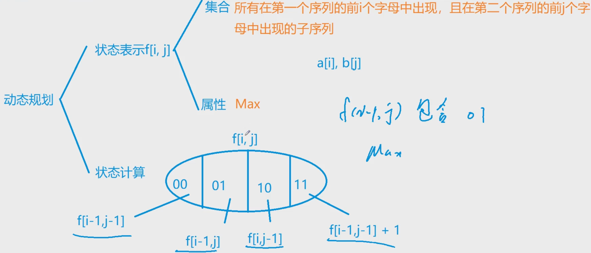

# 求公共子序列

区间的状态表示
|区间|表示|
|---|---|
|00|不含$f(i,j)$, `f(i-1,j-1)`|
|11|所有元素都包含$f(i,j)$, 将所有元素都减去$f(i,j)$,在加上1, `f(i-1,j-1)+1`|
|01|$f(i-1,j)$表示所有在第一个前$i-1$字母中出现,并且在第2个字符串的前$j$个字母中出现的最大值 01表示$ai$不出现在子序列中,$bj$一定出现在子序列中, $f(i-1,j)$一定包含01的所有区间|
|10|同上10, 这两种区间存在重合, 但是问题不大|

- 求min,max时罗列出来的子区间可以重合,但是求数量时不行