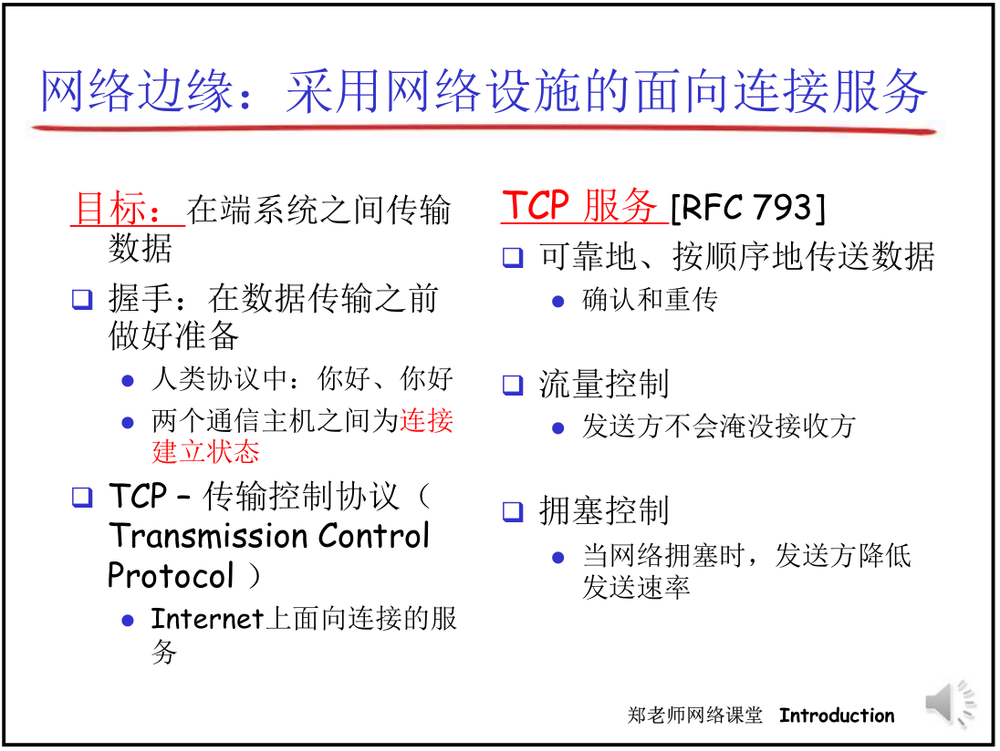
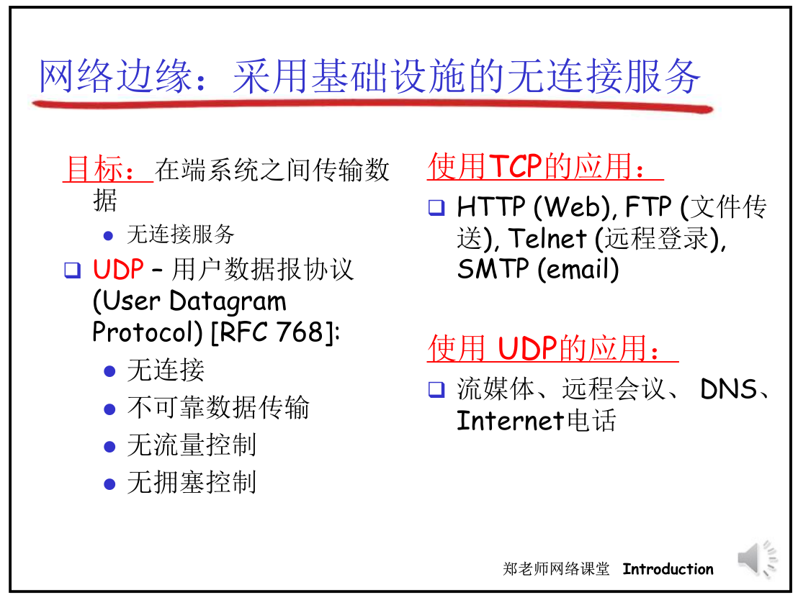

# 网络结构
|网络边缘|网络核心|接入网、物理媒体|
|---|---|---|
|主机(端系统)edge|网络交换节点(分组交换机)、 通信链路|源端系统链接的第一条交换机的通道access|

|思考|
|:---:|
|网络边缘包括哪些?它和应用进程之间通讯的模式大概有几种?|
|网络核心最主要的作用是什么?组成是什么?工作原理是什么?功能是怎么实现的?|
|接入网以什么样的媒体形式?工作方式是什么?工作原理是什么|

## 网络边缘
    因为计算机和其他设备位于因特网的边缘, 因此被称为端系统

    边缘系统上运行的网络运用，是网络存在的理由
- **端系统**包括桌面计算机、服务器和移动计算机
- 端系统被称为主机，因为它们容纳应用程序、
  
主机一般也被分为两大类(主从模式)
|客户|服务器|
|---|---|
|桌面PC，移动PC和智能手机等|更强大的机器，用于存储和发布web网页，流视频、中继电子邮件等|
- 随着用户请求数量的增加，在达到一定的阈值时，服务器的响应速率会呈现断崖式的下降
- 为了优化上述客户/服务器的缺陷，使用对等（peet-peer）模式，即创建一个节点，**用户**向该节点请求资源，**该节点**向服务器请求资源。这样就在增加向服务器请求节点数量的同时，增加了分配资源的节点（通讯是分布式）
  - TCP服务中**面向连接**：两个通信进程和其底层的TCP实体知道TCP协议的内容和格式，而网络（网络中心）不知道，**通信的状态只是在端系统当中维护**
  - 如果中间所有节点都知道它们的连接协议内容，就叫做**有链接**

## 网络核心
    起到数据交换的作用

|组成|
|:---:|
|互连的路由器和交换机|
## 接入网
    将端系统物理连接到边缘路由器的网络
    边缘路由器：端系统到任何其他远程端系统的路径上的第一台路由器
### 家庭接入：DSL、电缆、FTTH和5G固定式无线
- 宽带住宅装入为数字用户线（Digital Subscriber Line, DSL）和电缆
- 住宅电话线同时承载了数据和传统的电话信号
  |通道|频段|
  |---|---|
  |高速下行通道|位于50KHz~1MHz|
  |中速上行通道|位于4KHz~50KHz|
  |普通的双向电话通信|位于0~4KHz|
  
  因此一个电话呼叫和一个因特网连接就能同时共享DSL链路

实际取得的**下行**和**上行传输速率**也许**小于**以上的速率,因为`家庭在DSL提供商购买的套餐、或家庭与本地中心局之间的距离、双胶线的规格和电器干扰的程度`而使最大速率受限。\
故一般家庭与本地中心局**距离短**就接入DSL，如果不是位于中心局5~10英里范围内，就必须采取其他方式的接入。
- 光纤到户(FTTH)就是**一条从本地中心局直接到家庭的光纤路径**, 传输速率快, 信号衰减极低,但是光设备成本高(例如:发送器,接收器和交换机)
- 5G固定式无线: 不需要搭建布线系统, 使用波束成型技术, **数据以无线方式从供应商的基站发送到家中的调制解调器**。一个无线路由器直接与该解调器连接
### 企业（和家庭）接入：以太网和WiFi
- 以太网： 用户使用双绞铜线与一台以太网交换机相连
- WiFi：无线用户从一个接入节点发送分组，该接入节点与企业网连接
### 广域无线接入：3G、LTE 4G和5G
通过蜂窝网提供商运营的基站来发送和接收分组。与WIFI不同的是，用户可以距离基站数万米