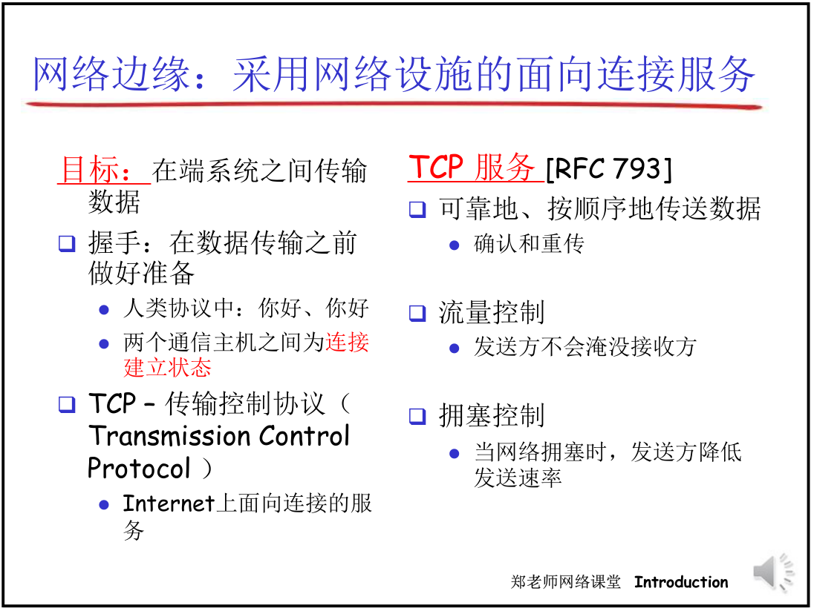
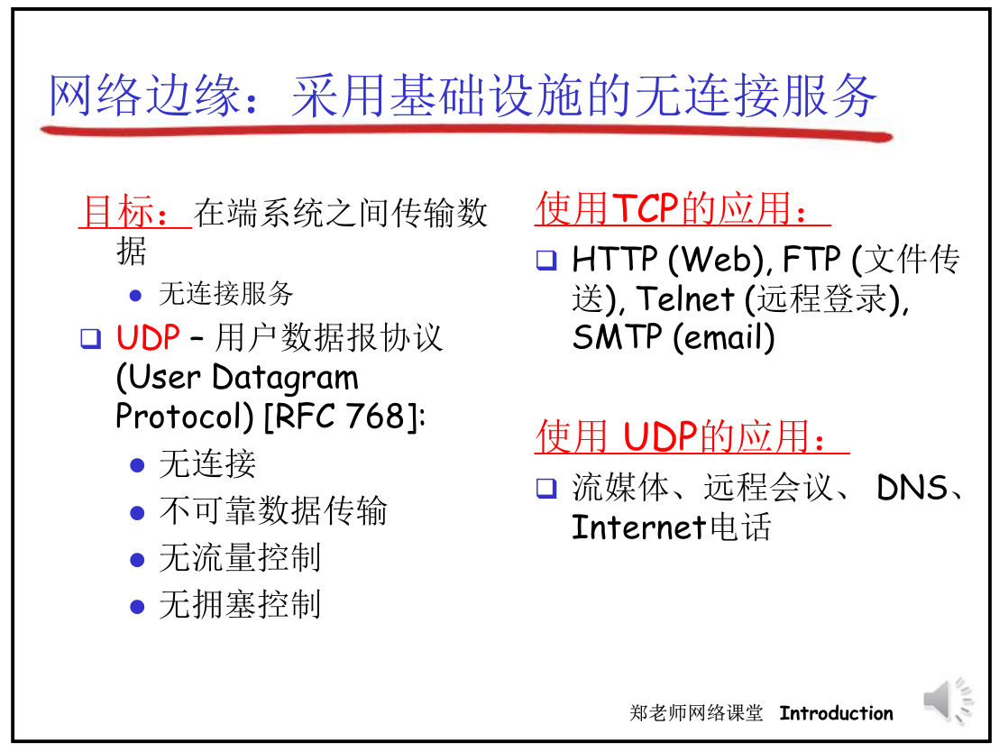

# 网络结构
|网络边缘|网络核心|接入网、物理媒体|
|---|---|---|
|主机(端系统)edge|网络交换节点(分组交换机)、 通信链路|源端系统链接的第一条交换机的通道access|

|思考|
|:---:|
|网络边缘包括哪些?它和应用进程之间通讯的模式大概有几种?|
|网络核心最主要的作用是什么?组成是什么?工作原理是什么?功能是怎么实现的?|
|接入网以什么样的媒体形式?工作方式是什么?工作原理是什么|

## 网络边缘
    因为计算机和其他设备位于因特网的边缘, 因此被称为端系统

    边缘系统上运行的网络运用，是网络存在的理由
- **端系统**包括桌面计算机、服务器和移动计算机
- 端系统被称为主机，因为它们容纳应用程序、
  
主机一般也被分为两大类(主从模式)
|客户|服务器|
|---|---|
|桌面PC，移动PC和智能手机等|更强大的机器，用于存储和发布web网页，流视频、中继电子邮件等|
- 随着用户请求数量的增加，在达到一定的阈值时，服务器的响应速率会呈现断崖式的下降
- 为了优化上述客户/服务器的缺陷，使用对等（peet-peer）模式，即创建一个节点，**用户**向该节点请求资源，**该节点**向服务器请求资源。这样就在增加向服务器请求节点数量的同时，增加了分配资源的节点（通讯是分布式）
  - TCP服务中**面向连接**：两个通信进程和其底层的TCP实体知道TCP协议的内容和格式，而网络（网络中心）不知道，**通信的状态只是在端系统当中维护**
  - 如果中间所有节点都知道它们的连接协议内容，就叫做**有链接**

## 网络核心
    起到数据交换的作用

|组成|
|:---:|
|互连的路由器和交换机|
## 接入网
